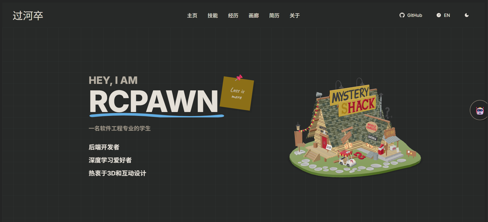
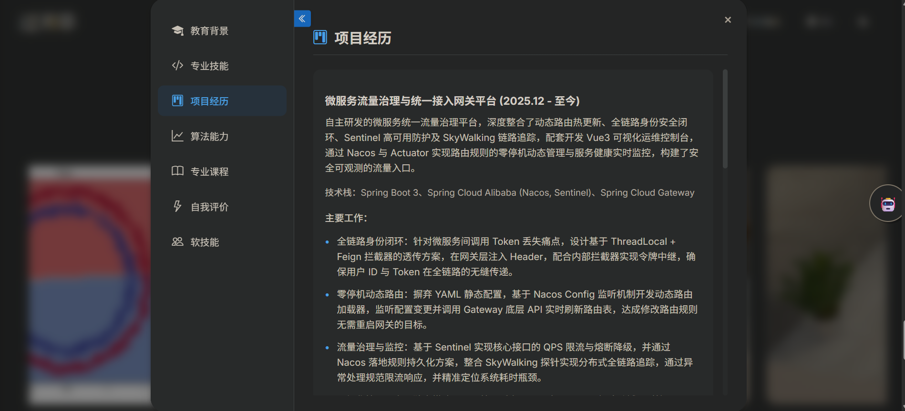
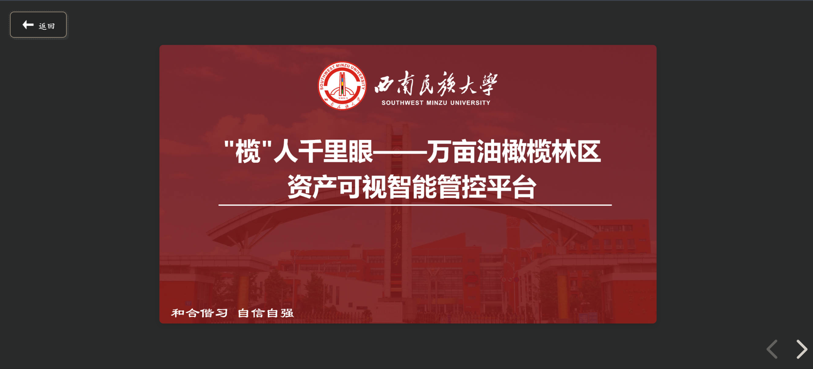
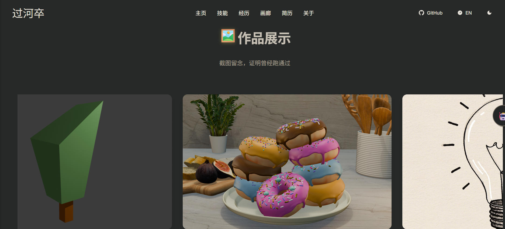

# 🚀 Resume Adventure

🔗 **项目地址**：https://resume-adventure.netlify.app/  
🐙 **源码仓库**：https://github.com/RCPawn/resume-adventure 

### 🏠 首页展示

1. **设计风格**：  
   页面采用深色网格背景，结合 Three.js 构建的 3D 低多边形场景元素（右侧《怪诞小镇》风格小屋），在保证信息可读性的同时增强空间感与沉浸感，体现技术与创意相结合的设计理念。

2. **功能模块**：  
   顶部导航栏整合主页、技能、学习经历等核心板块，并提供 GitHub 直达入口，形成集 **个人介绍、技术展示与项目索引** 于一体的综合展示平台。

---

### 📄 在线简历

在线简历模块以结构化方式展示个人的基本信息、技术栈与能力标签，相比传统 PDF 简历具备更好的交互性与可扩展性。

- 以模块化布局呈现技能、项目与个人优势
- 支持快速浏览与重点信息突出
- 作为求职与技术展示的线上入口，便于分享与访问

---

### 🎓 学习经历

学习经历模块用于记录个人的学习路径与阶段性成长过程：

---

### 🧊 通过 three.js 实现的在线演示

---

### 🧱 建模等截图

本部分展示了个人在 3D 建模与相关创作过程中的部分截图。

