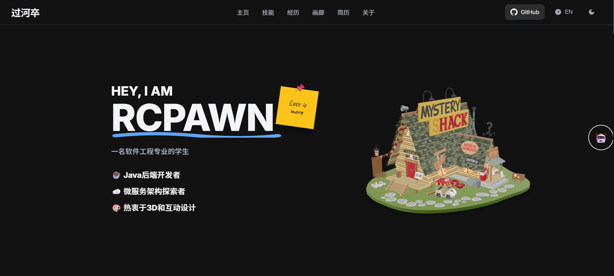
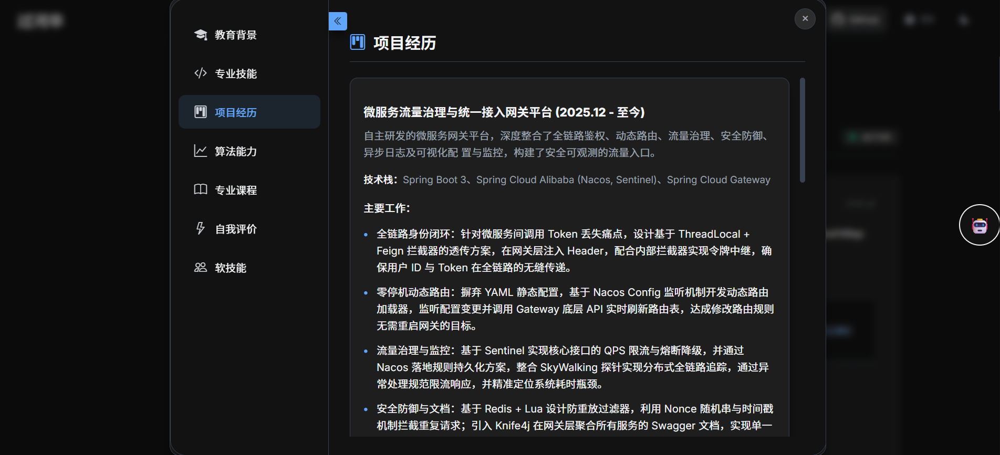
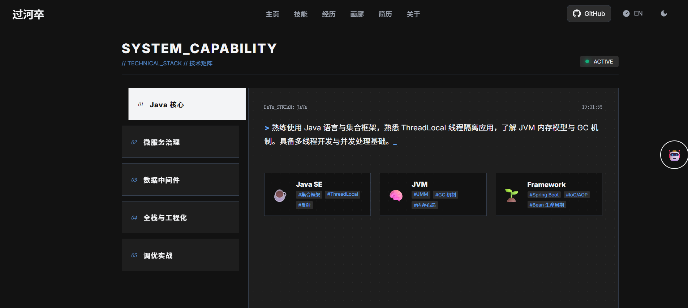
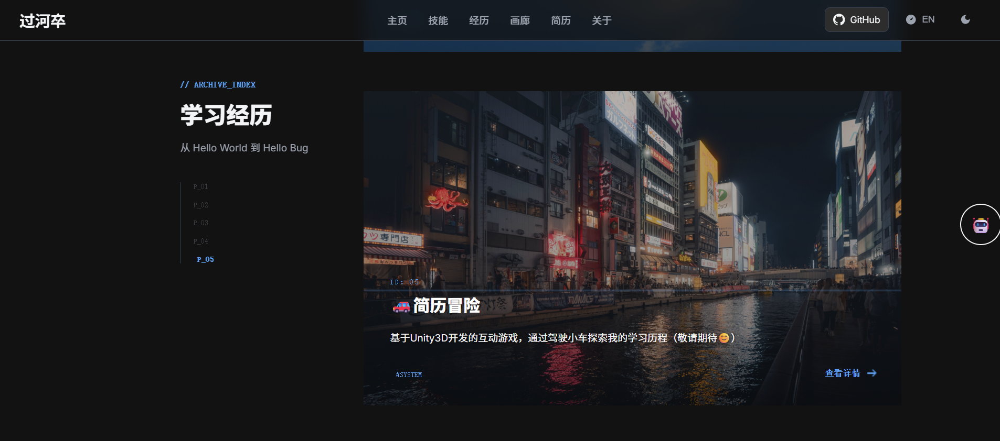
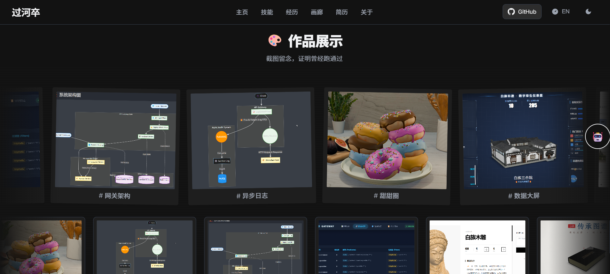

# 🚀 Resume Adventure | RCPawn's Dev Journey


一个基于 **Vue 3 + Vite** 构建的现代化个人作品集与在线简历。项目融合了 **3D WebGL 场景**、**Markdown 技术博客**以及**沉浸式 UI 设计**，旨在打造极致的技术与创意展示体验。

> 🔗 **在线预览**: https://rcpawn.netlify.app/

---

## ✨ 核心特性

### 🏠 沉浸式首页
- **3D 场景**: 基于 Three.js 与 `@google/model-viewer` 实现低多边形 3D 场景（怪诞小屋模型），支持鼠标交互。
- **多语言支持 (i18n)**: 内置中英文切换，满足国际化展示需求。
- **深色/浅色主题**: 一键切换白天黑夜模式，适配不同阅读环境。
- **动态光标**: 自定义鼠标光标跟随效果，增强交互趣味性。

### 📄 在线简历
- 采用结构化模块布局，展示技术栈、项目经历与教育背景。
- 相比传统 PDF 具备更好的响应式适配与可扩展性。

### 🛠️ 专业技能与学习经历
- **技能雷达图**: 直观展示后端 (Spring Boot/Cloud) 与前端 (Vue3/React) 能力分布。
- **学习路径**: 记录个人成长轨迹，支持时间轴展示。

### 📚 技术博客 (Project Detail)
- **Markdown 驱动**: 基于 `markdown-it` 渲染，支持代码高亮、图片懒加载。
- **自动生成目录 (TOC)**: 侧边栏目录支持滚动监听与锚点定位。
- **访问统计**: 集成不蒜子 (Busuanzi) 统计，记录总访问量、今日访客及单页阅读量。
- **SEO 友好**: 动态生成 Meta 标签，优化搜索引擎抓取。

---

## 📸 页面展示

### 首页与 3D 交互
<div align="center">
  
  <p><i>深色网格背景结合 3D 小屋模型，营造沉浸式科技感</i></p>
</div>

### 在线简历与技能展示
<div align="center">
  
  
</div>

### 学习经历与作品
<div align="center">
  
  
</div>

---

## 🛠️ 技术栈

| 类别 | 技术 |
|:---|:---|
| **框架** | Vue 3 (Composition API), Vite |
| **路由/状态** | Vue Router, Pinia |
| **UI/样式** | CSS3 Variables, Glassmorphism, GitHub Markdown CSS |
| **3D/图形** | Three.js, WebGL, Google Model Viewer |
| **工具链** | ESLint, Prettier, Markdown-it |
| **部署** | Netlify (CI/CD 自动部署) |

---

## 🚀 快速开始

### 1. 安装依赖
```bash
npm install

### 2. 启动开发服务器
```bash
npm run dev

### 3. 构建生产版本
```bash
npm run build

### 4. 本地预览
```bash
npm run preview

```
---

## 📂 目录结构

```bash
resume-adventure/
├── public/
│   ├── models/          # 3D 模型文件 (.glb)
│   ├── projects/        # 博客 Markdown 源文件与图片
│   └── WebGL Builds/    # Unity WebGL 导出文件
├── src/
│   ├── components/      # 公共组件 (NavBar, Footer, 3DViewer 等)
│   ├── views/           # 页面视图 (Home, ProjectDetail, GameView 等)
│   ├── data/            # 多语言配置 (cn.js, en.js) 与项目元数据
│   ├── router/          # Vue Router 配置
│   ├── utils/           # 工具函数 (统计, 格式化)
│   └── assets/          # 静态资源与全局样式
└── index.html           # 入口文件
```

---

> Designed & Built by **rcpawn** with ❤ and ☕