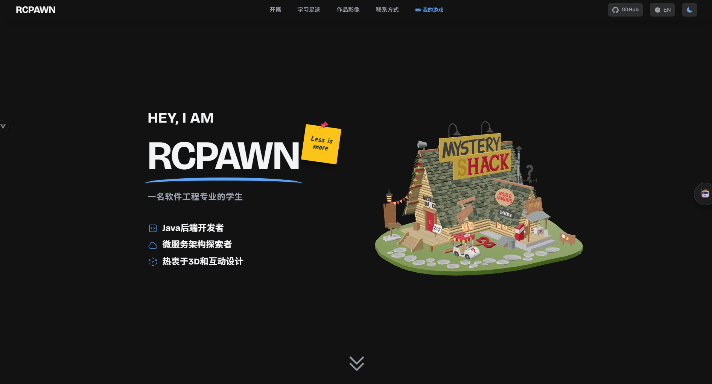
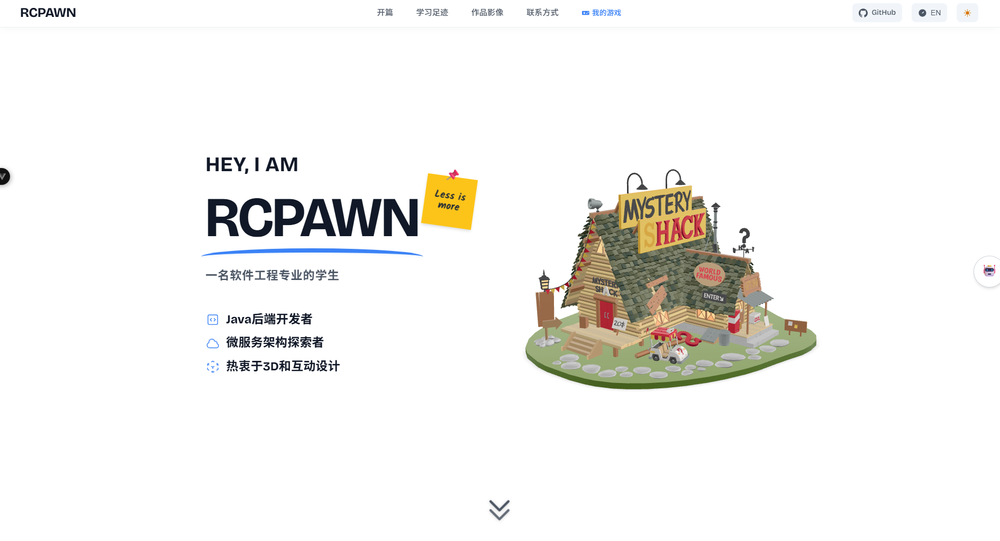
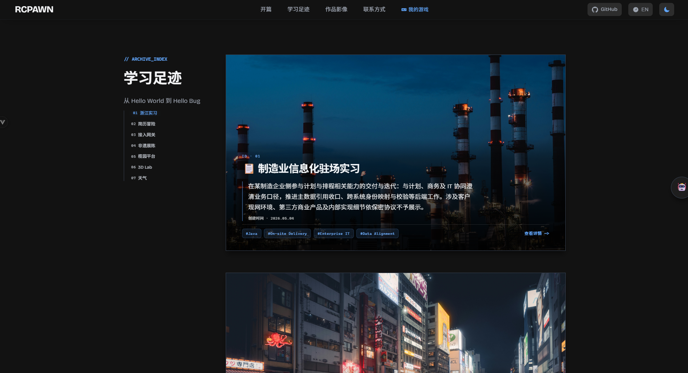
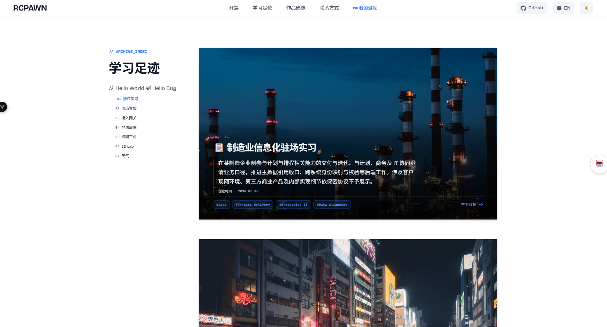
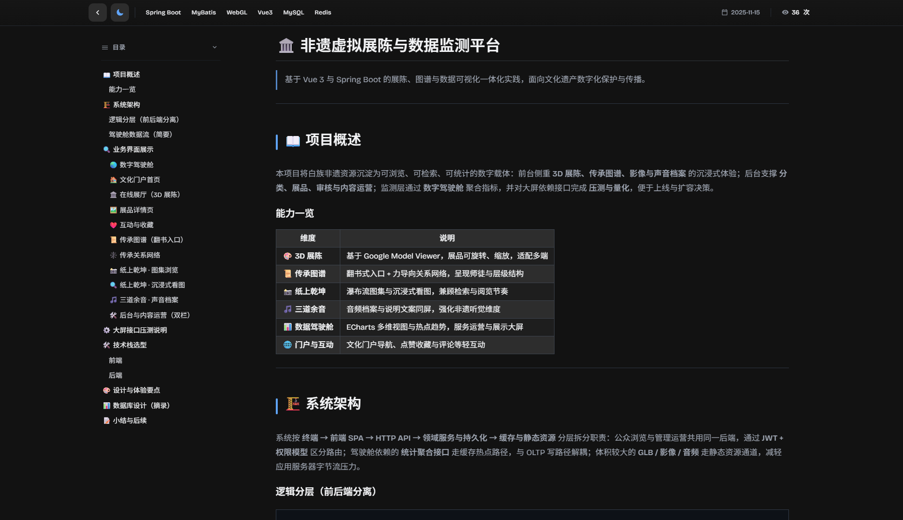
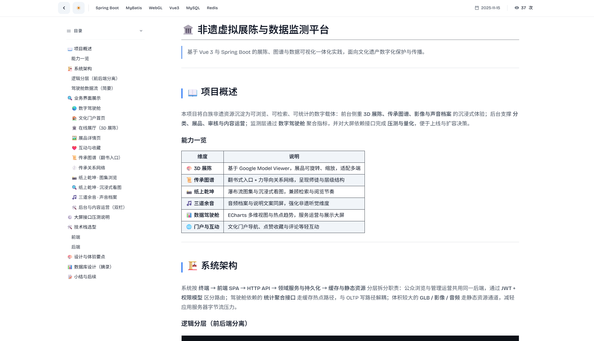
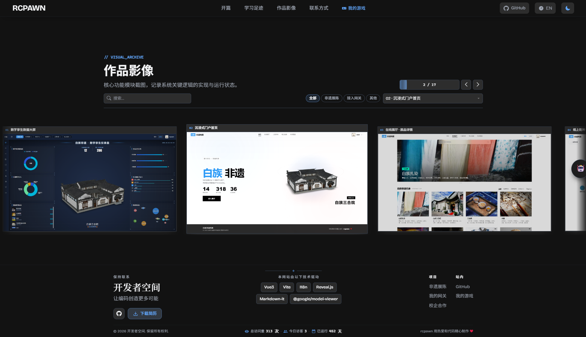
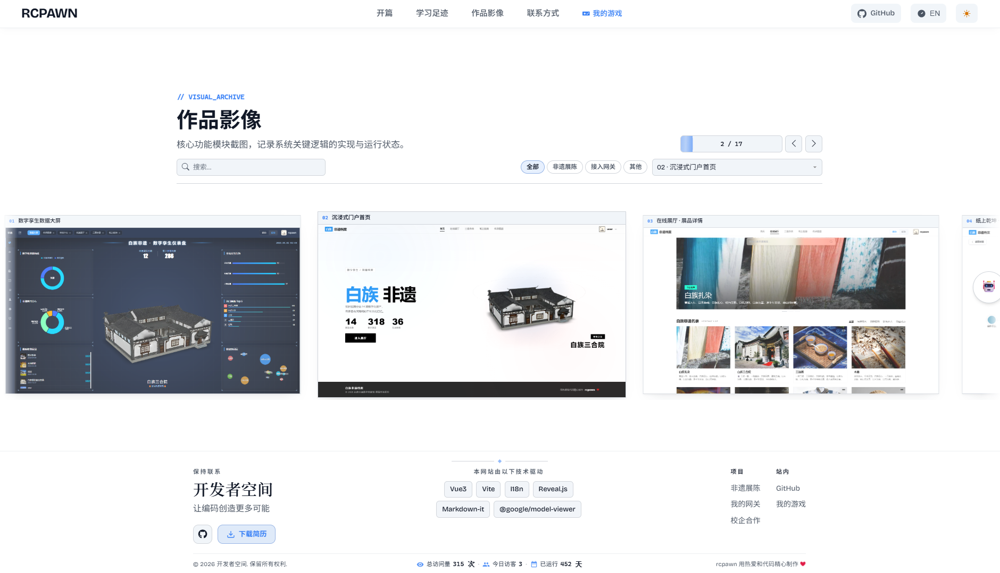

# Resume Adventure · RCPawn's Dev Journey

[](https://vuejs.org/)
[](https://vitejs.dev/)
[](https://www.netlify.com/)

基于 **Vue 3 + Vite** 的现代化个人站点：将 **3D 场景**、**结构化履历**、**学习足迹（项目长文）** 与 **作品影像（画廊）** 统一在同一套视觉与交互语言下，并支持 **中/英** 与 **深/浅色** 主题切换。

**在线预览：** [https://rcpawn.netlify.app/](https://rcpawn.netlify.app/)

---

## 目录

- [项目概览](#项目概览)
- [功能亮点](#功能亮点)
- [界面导览](#界面导览)
- [技术栈](#技术栈)
- [本地开发](#本地开发)
- [仓库结构](#仓库结构)
- [相关文档](#相关文档)

---

## 项目概览

本站面向「作品集 + 在线简历 + 技术叙事」场景：首页以 **WebGL / Model Viewer** 呈现可交互的 3D 主体；中段模块按信息架构拆分——**学习足迹**侧重项目与时间线叙事，**作品影像**侧重视觉作品浏览与筛选；项目详情页提供 **Markdown 长文**、**目录导航**、**代码高亮** 等阅读体验，并可配合站内统计方案观察访问情况（详见 `docs/` 下说明）。

---

## 功能亮点

| 模块 | 说明 |
|------|------|
| **开篇（首页）** | 3D 低多边形场景、自定义光标与动效、主题与语言切换；首屏与内容区采用统一的区块标题与排版变量。 |
| **在线简历** | 响应式布局展示技术栈、经历与教育背景，相比静态 PDF 更易维护与适配多端。 |
| **学习足迹** | 项目列表、时间线与详情路由；长文由 Markdown 驱动，支持 TOC、锚点与阅读宽度约束。 |
| **作品影像** | 画廊式展示与工具条（筛选、分页等）模式，强调空状态与可访问性约定。 |
| **工程化** | ESLint / Prettier、组件与数据分层、`vue-i18n` 文案与数据键同步维护。 |

---

## 界面导览

以下截图均来自 `README.assets/`，按 **深色主题** 与 **浅色主题** 对照展示，便于快速了解整站气质与可读性。

### 开篇 · 首页与 3D 场景

首屏融合场景主体与导航：深色底强调对比与光感，浅色底侧重清爽阅读。

<table>
  <tr>
    <td width="50%" align="center"><strong>深色主题</strong></td>
    <td width="50%" align="center"><strong>浅色主题</strong></td>
  </tr>
  <tr>
    <td align="center"></td>
    <td align="center"></td>
  </tr>
</table>

### 学习足迹 · 列表与时间线

项目与学习路径的主入口：卡片信息、元数据与「下一步」动线对齐站内标杆模块（`ProjectsSection`）。

<table>
  <tr>
    <td width="50%" align="center"><strong>深色主题</strong></td>
    <td width="50%" align="center"><strong>浅色主题</strong></td>
  </tr>
  <tr>
    <td align="center"></td>
    <td align="center"></td>
  </tr>
</table>

### 学习足迹 · 项目详情（长文阅读）

正文区与侧栏目录（TOC）协同：宽屏双栏、窄屏堆叠，代码块与 Markdown 样式与全局 token 一致。

<table>
  <tr>
    <td width="50%" align="center"><strong>深色主题</strong></td>
    <td width="50%" align="center"><strong>浅色主题</strong></td>
  </tr>
  <tr>
    <td align="center"></td>
    <td align="center"></td>
  </tr>
</table>

### 作品影像 · 画廊浏览

以「主舞台 + 工具条」组织筛选与分页，强调媒体展示效率与边界反馈（无结果、加载中等状态）。

<table>
  <tr>
    <td width="50%" align="center"><strong>深色主题</strong></td>
    <td width="50%" align="center"><strong>浅色主题</strong></td>
  </tr>
  <tr>
    <td align="center"></td>
    <td align="center"></td>
  </tr>
</table>

---

## 技术栈

| 类别 | 技术 |
|------|------|
| **框架** | Vue 3（Composition API）、Vite 6 |
| **路由 / 状态** | Vue Router、Pinia、Vuex（沿用部分场景） |
| **国际化** | vue-i18n |
| **内容** | markdown-it、highlight.js、github-markdown-css；Mermaid、Reveal.js 等（按页面启用） |
| **可视化 / 动效** | ECharts、D3、GSAP |
| **3D** | `@google/model-viewer`、Three.js 生态（类型与资源管线） |
| **UI 组件** | Ant Design Vue、Element Plus / Font Awesome / 多图标包按需引入 |
| **工具** | ESLint、Prettier、Sass |
| **部署** | Netlify（可配合 CI/CD 自动构建发布） |

---

## 本地开发

**环境要求：** Node.js（建议使用当前 LTS），包管理器任选 `npm` / `pnpm` / `yarn`。

```bash
# 安装依赖
npm install

# 启动开发服务器
npm run dev

# 生产构建
npm run build

# 本地预览构建产物
npm run preview
```

构建与预览默认遵循 Vite 配置；若需对接 Netlify，请参考仓库内环境变量与构建命令约定（如有）。

---

## 仓库结构

```text
resume-adventure/
├── public/
│   ├── models/           # 3D 模型等资源（如 .glb）
│   ├── projects/         # 项目 Markdown、配图等静态内容
│   └── WebGL Builds/     # Unity WebGL 导出（若使用）
├── src/
│   ├── components/       # 导航、页脚、3D 容器、各 Section 等
│   ├── views/            # 页面级视图（首页、项目详情、游戏入口等）
│   ├── data/             # 多语言文案、项目元数据等
│   ├── router/           # 路由表
│   ├── utils/            # 工具函数（统计、格式化等）
│   └── assets/           # 样式与站内静态资源
├── docs/                 # 面向维护者的说明文档（接入、模块设计等）
├── README.assets/        # README 用截图资源
└── index.html
```

---

## 相关文档

仓库内部分设计/接入说明（持续补充）：

- [`docs/不蒜子接入说明.md`](docs/不蒜子接入说明.md) — 访问量统计的 DOM 与请求约定  
- [`docs/技术分享模块-设计文档.md`](docs/技术分享模块-设计文档.md) — 技术分享 / 站内知识库模块的规划与信息架构（与现有「学习足迹」叙事互补）

---

Designed and built by **rcpawn**.
