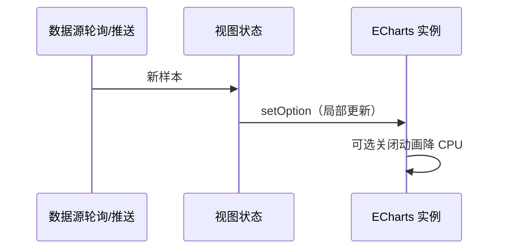
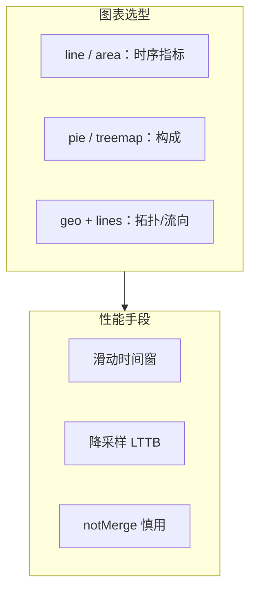

# 数字驾驶舱与实时监控：ECharts 工程实践要点

## 概述

归纳基于 [Apache ECharts](https://echarts.apache.org/zh/index.html) 构建数字孪生大屏、实时流量监控时的**图表选型、增量更新与性能**要点，便于与网关治理、Metrics 叙事对照阅读。

## 前置条件

| 项目 | 说明 |
|------|------|
| 运行时 | 现代浏览器（WebGL/Canvas 由 ECharts 内部选用） |
| 依赖 | 本站 `package.json` 中 `echarts` ^5.5；按需 `import * as echarts from 'echarts/core'` 做按需引入时可减小包体 |
| 前置知识 | 了解 `setOption`、series、`xAxis`/`yAxis` 的基本对应关系 |

## 快速开始

在已存在的 Vue 项目中安装依赖（若尚未安装）：

```bash
$ npm install echarts
```

创建一个最小折线图实例（可在任意挂载完毕的 `div` 上调用）：

```javascript
import * as echarts from 'echarts'

// 1. 绑定 DOM 节点
const chart = echarts.init(document.getElementById('main'))

// 2. 首次 setOption 定义系列与时间轴
chart.setOption({
  xAxis: { type: 'time' },
  yAxis: { type: 'value' },
  series: [{ type: 'line', data: [] }],
})

// 3. 后续仅增量推送数据时可再次 setOption（默认 merge）
chart.setOption({
  series: [{ data: [[Date.now(), 42]] }],
})
```

终端无额外输出；浏览器中应看到坐标轴与系列就绪。

## 核心概念

结论：**时间序列类监控优先用增量 `setOption` + 控制时间窗**；读放大屏对比度与多图 `axisPointer` 对齐，避免误读。





## 详细配置

以下为 **`setOption` 常用字段级**说明（第二列为类型习惯写法，第三列为常见默认或推荐起点）。

### 全局/partial

| 选项路径 | 类型 | 默认/说明 |
|----------|------|-----------|
| `notMerge` | `boolean` | `false`：增量合并；全量替换时用 `true` |
| `lazyUpdate` | `boolean` | `false`；高频更新可考虑 `true` 批量刷新 |
| `animation` | `boolean` | 大屏实时刷新常设 `false` 减 CPU |
| `animationDuration` | `number` | `ms`；关闭动画时可忽略 |

### `xAxis`（时间序列）

| 选项路径 | 类型 | 默认/说明 |
|----------|------|-----------|
| `type` | `'time' \| 'category'` | 监控多用 `time` |
| `splitLine.show` | `boolean` | 深色背景慎用高对比网格线 |

### `series-line`

| 选项路径 | 类型 | 默认/说明 |
|----------|------|-----------|
| `showSymbol` | `boolean` |  dense 数据可 `false` |
| `sampling` | `string` | 大数据量可用 `'lttb'` |
| `areaStyle` | `object` | 主次序列用透明度区分 |

### 联动 `axisPointer`

| 选项路径 | 类型 | 说明 |
|----------|------|------|
| `axisPointer.link` | `array` | 多图同一 `xAxisIndex` 或 `xAxisId` 对齐 |

> ⚠️ **注意**：地理/流向类图表仅在**坐标与数据可信**时使用；避免硬编码虚假弧误导运维判断。

## 代码示例

### 示例 1：增量更新曲线（注释逐步说明）

```javascript
import * as echarts from 'echarts'

const el = document.getElementById('qps-chart')
const chart = echarts.init(el)

// 初始骨架：定好坐标系与系列 id，后续只喂数据
chart.setOption({
  tooltip: { trigger: 'axis' },
  xAxis: { type: 'time' },
  yAxis: { type: 'value', name: 'QPS' },
  series: [{ id: 'qps', type: 'line', data: [], showSymbol: false }],
})

function appendPoint(ts, value) {
  // 从 option 取出当前 data，避免覆盖其它系列配置
  const opt = chart.getOption()
  const series = opt.series[0]
  const next = [...(series.data || []), [ts, value]]
  // 滑动窗口：只保留最近 N 分钟（示意：按点数截断）
  const windowed = next.slice(-600)
  chart.setOption({ series: [{ id: 'qps', data: windowed }] })
}
```

### 示例 2：暗色大屏读三个视觉层次

```javascript
chart.setOption({
  backgroundColor: '#0b1220',
  textStyle: { color: '#9fb0c5' },
  xAxis: {
    axisLine: { lineStyle: { color: '#30363d' } },
    splitLine: { lineStyle: { color: 'rgba(148,163,184,0.15)' } },
  },
  series: [
    {
      type: 'line',
      lineStyle: { width: 2, color: '#58a6ff' },
      areaStyle: { color: 'rgba(88,166,255,0.08)' },
    },
  ],
})
```

语义色（成功/告警/严重）建议在全局主题层固定色相，与网关告警分级一致。

## 常见问题

**CPU 占用高、风扇狂转？**  
关闭动画、限制点数（时间窗 + 降采样）、降低 `setOption` 频率（合并 100–300ms 一批）。

**两条曲线时间戳对不齐？**  
统一服务端时钟与采样间隔；前端对齐到同一 `xAxis` 类型与时间解析规则。

**饼图类别过多挤成一团？**  
合并「其他」、或换 `treemap`/表格；大屏首要任务是可比性而非展示所有原始维度。

**与网关文档中的 Metrics 是什么关系？**  
ECharts 展示的是**已聚合指标**；采集规则、标签基数与告警阈值仍在后端与 Prometheus 等系统中定义。

## 延伸阅读

- [ECharts 手册](https://echarts.apache.org/zh/option.html) — 全部配置项与默认值  
- [ECharts 按需引入](https://echarts.apache.org/handbook/zh/basics/import) — 控制包体  
- 站内：`docs/technical/网关与可观测性栈.md`（入口层与指标语义）
