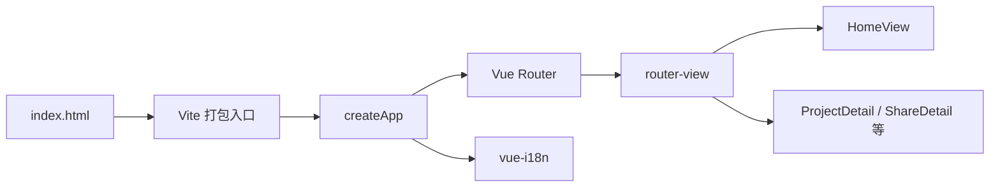
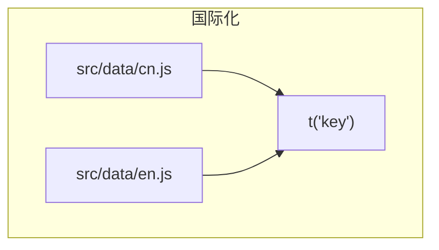

# 本站前端架构：Vite 与 Vue 3 SPA

## 概述

说明 **resume-adventure** 如何用 **Vite 6** 作为开发与构建工具链、**Vue 3 Composition API** 作为视图层，并在 **Vue Router 4** + **vue-i18n** 下组织单页应用（SPA），便于对照学习足迹中的后端与可视化主题。

## 前置条件

| 项目 | 版本/要求（以仓库 `package.json` 为准） |
|------|----------------------------------------|
| Node.js | 建议使用 **18.x 或 20.x LTS**（与 Vite 6 生态一致） |
| `vite` | ^6.0.11 |
| `vue` | ^3.5.13 |
| `vue-router` | ^4.5.0 |
| `vue-i18n` | ^10.0.5 |
| 渲染模式 | 当前为 **纯 CSR**（无 SSR）；SEO 若增强需另选预渲染或独立文档站 |

## 快速开始

```bash
$ git clone <仓库 URL>
$ cd resume-adventure
```

```bash
$ npm install
```

```bash
$ npm run dev
```

终端示例输出（具体端口以本机为准）：

```text
  VITE v6.x.x  ready in xxx ms

  ➜  Local:   http://localhost:5173/
  ➜  Network: use --host to expose
```

浏览器打开上述 Local 地址即可访问首页。生产构建与预览：

```bash
$ npm run build
```

```bash
$ npm run preview
```

## 核心概念

结论：**URL → Router → 异步页面组件 → 业务模块**；文案与数据分离（`vue-i18n` + `src/data/*.js`）；静态资源与 Markdown 正文由 Vite 在构建期打包。





- **代码分割**：路由级 `import()` 懒加载，避免首屏加载全部详情页与 Markdown 管线。
- **路径别名**：源码中 `@/` 指向 `src/`（见 `vite.config` 内 `resolve.alias` 约定）。
- **主题**：全局 CSS 变量（`main.css`）驱动亮/暗，与文档页 `ShareDetail` 的 Mermaid 主题联动。

## 详细配置

### npm 脚本（`package.json`）

| 脚本 | 命令 | 说明 |
|------|------|------|
| `dev` | `vite` | 开发服务器 + HMR |
| `build` | `vite build` | 生产构建 |
| `preview` | `vite preview` | 本地预览构建产物 |

### Vite 常用环境变量（客户端）

| 变量 | 类型 | 默认 | 说明 |
|------|------|------|------|
| `import.meta.env.BASE_URL` | `string` | `/` 或配置的 `base` | 路由与静态资源前缀；`markdownItDoc` 拼接图片 URL 时使用 |
| `import.meta.env.DEV` | `boolean` | 开发为 `true` | 调试分支可用 |
| `import.meta.env.PROD` | `boolean` | 生产为 `true` | 压缩与日志策略 |

### Router `meta`（约定）

| 字段 | 类型 | 说明 |
|------|------|------|
| `title` / 自定义键 | `string` | 页面标题或与 `useHead` 类逻辑配合（若引入） |

具体路由见 `src/router/index.js`。

### 国际化

| 概念 | 说明 |
|------|------|
| 文案键 | 集中在 `src/data/cn.js`、`en.js`，组件内 `const { t } = useI18n()` |
| 切换语言 | 不应为切换语言单独触发第三方统计请求（见不蒜子文档） |

> ⚠️ **注意**：全文库正文来自 `docs/technical` 构建收录，与 vue-i18n 并行存在——页面壳层多语言与 Markdown 正文语言由内容策略决定。

## 代码示例

### 示例 1：新增一条懒加载路由（注释字段含义）

在 `src/router/index.js` 中增加子路由时：

```javascript
{
  path: '/share/:slug',
  name: 'share-detail',
  component: () => import('../views/ShareDetail.vue'), // 懒加载，拆分包体
}
```

`import()` 返回 Promise，由 Router 在首次进入路由时解析；`:slug` 对应栈迹文库条目的 `slug`。

### 示例 2：在组件中使用 i18n 与路由

```vue
<script setup>
import { useI18n } from 'vue-i18n'
import { useRouter } from 'vue-router'

const { t } = useI18n()
const router = useRouter()

function goShare(slug) {
  // 编程式导航到文档详情
  router.push({ name: 'share-detail', params: { slug } })
}
</script>

<template>
  <button type="button" @click="goShare('vite-vue-spa-architecture')">
    {{ t('some.buttonLabel') }}
  </button>
</template>
```

## 常见问题

**生产环境路由 404？**  
静态托管需将所有路径回退到 `index.html`（SPA fallback）；Vite 预览已处理，自建 Nginx/Caddy 需单独配置 `try_files`。

**为何不用 SSR？**  
当前聚焦作品集与文档展示，CSR 简单可靠；若需搜索收录增强，可评估 `vite-plugin-ssg` 或独立文档框架。

**Pinia 与 Vuex 并存？**  
`package.json` 同时列出二者时，新功能优先 **Pinia**（Vue 3 官方推荐）；渐进迁移时避免双注册全局 store。

**大图片或 Markdown 很慢？**  
优先路由懒加载 + 正文按需请求（本站文库为构建期打包正文，适合文档体量可控的场景）。

## 延伸阅读

- [Vite 指南](https://cn.vitejs.dev/guide/) — 配置、环境变量与 `base`  
- [Vue 3 文档](https://cn.vuejs.org/) — 组合式 API、`script setup`  
- [Vue Router](https://router.vuejs.org/zh/) — 路由与导航守卫  
- [vue-i18n](https://vue-i18n.intlify.dev/) — 国际化组合式用法  
- 站内：`docs/technical/栈迹文库-Markdown与Mermaid.md`、`docs/technical/不蒜子接入说明.md`
