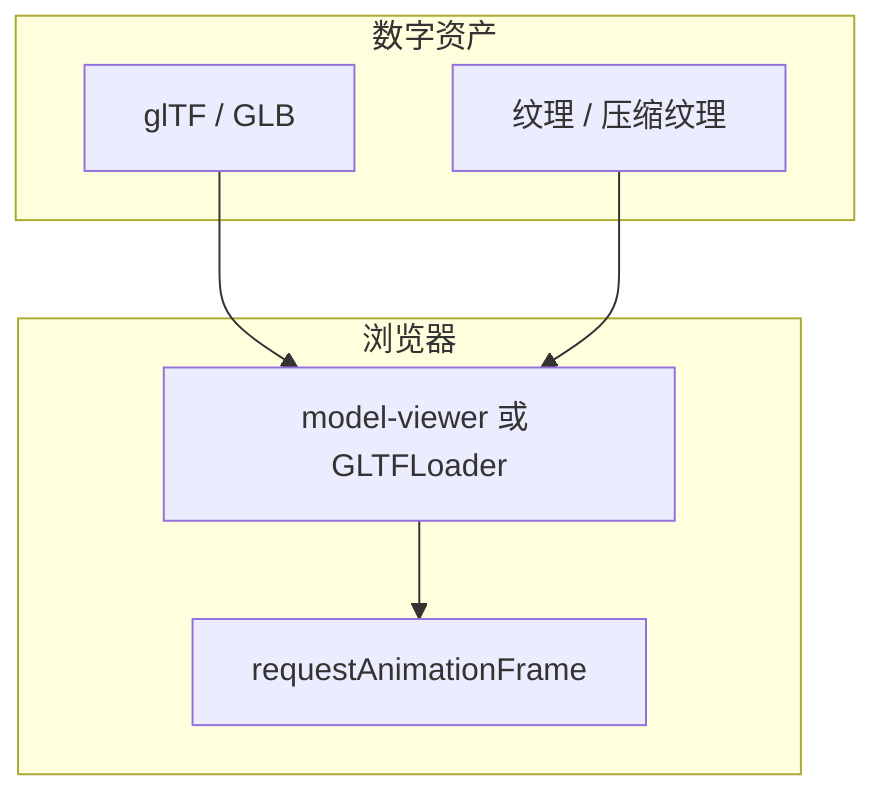
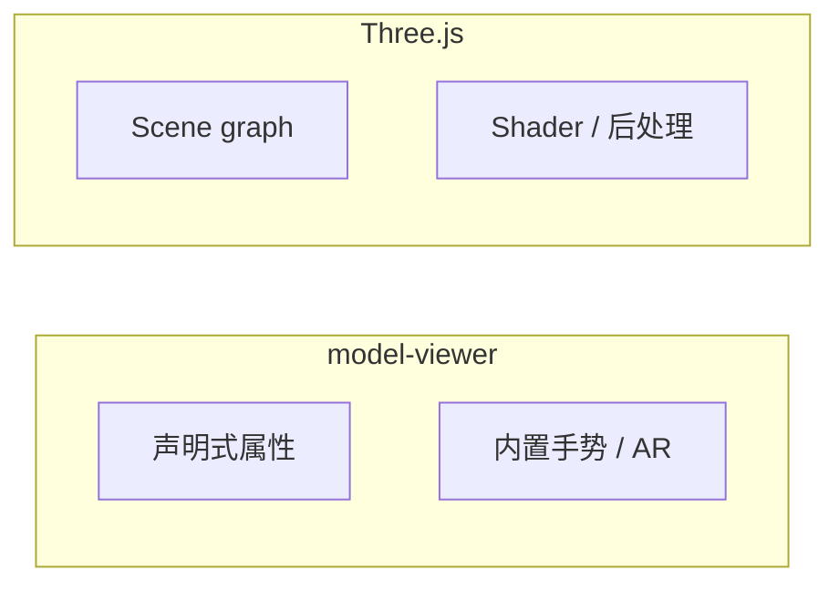

# 非遗展陈中的 WebGL：Three.js 与 model-viewer 选型

## 概述

说明在浏览器中呈现 glTF/GLB 与展厅场景时，**Three.js 自建场景**与 **`<model-viewer>` Web Component** 两条路径的分工、包体与交互边界，便于与「非遗虚拟展陈」「3D Lab」类学习足迹条目对齐理解。

## 前置条件

| 项目 | 说明 |
|------|------|
| 本站依赖 | `@google/model-viewer` ^4；`draco3dgltf` ^1.5（Draco 解码）；`@types/three` 在 devDependencies 供 TS 工程参考 |
| 资产格式 | 优先 **glTF 2.0 / GLB**；大模型结合 Draco、Meshopt、纹理压缩等管线 |
| 运行环境 | WebGL/WebGPU 能力因浏览器与 GPU 而异；移动端需控制像素比与 draw call |

## 快速开始

### 路径 A：model-viewer（单模型橱窗）

本站 `vite.config.js` 已将 `model-viewer` 标为自定义元素（`isCustomElement`），避免 Vue 将其当作未知组件报错。模板中可直接书写标签：

```bash
$ npm install @google/model-viewer
```

```vue
<template>
  <!-- 声明式属性驱动旋转、缩放、AR 入口等 -->
  <model-viewer
    src="/models/sample.glb"
    alt="展品描述"
    camera-controls
    auto-rotate
    style="width: 100%; height: 400px;"
  />
</template>
```

### 路径 B：Three.js（自定义场景）

```bash
$ npm install three
```

```javascript
import * as THREE from 'three'

// 1. 场景 / 相机 / 渲染器
const scene = new THREE.Scene()
const camera = new THREE.PerspectiveCamera(50, 16 / 9, 0.1, 100)
const renderer = new THREE.WebGLRenderer({ antialias: true, alpha: true })
renderer.setPixelRatio(Math.min(window.devicePixelRatio, 2))
renderer.setSize(800, 450)

// 2. 载入 GLB（需配合 GLTFLoader，此处仅示意管线）
// const loader = new GLTFLoader()
// loader.load('/models/sample.glb', (gltf) => { scene.add(gltf.scene) })

// 3. 帧循环
function tick() {
  requestAnimationFrame(tick)
  renderer.render(scene, camera)
}
tick()
```

## 核心概念

结论：**model-viewer 适合「单资产产品级查看器」；Three.js 适合「多物体、自定义着色与交互逻辑」**。两者都依赖 **异步加载 + 帧循环**，差异在抽象层级与包体策略。





## 详细配置

### 选型对照（无「默认值」，为维度共识）

| 维度 | Three.js | model-viewer |
|------|----------|----------------|
| 上手曲线 | 需自建场景、灯光、相机 | 标签属性即可完成基础展示 |
| 交互深度 | 自定义着色器、后处理、物理材质 | 面向查看器：旋转、缩放、部分 AR |
| 包体 | 可按需 `three/addons` 拆分引入 | 单组件一站式，需评估整体体积 |
| 典型用途 | 展厅漫游、多物体编排 | 单展品高精度橱窗、快速迭代 |

### Draco / Meshopt（加载侧）

| 名称 | 类型 | 说明 |
|------|------|------|
| Draco | 几何压缩 | 需在加载器侧启用对应解码器（本站已有 `draco3dgltf` 依赖） |
| Meshopt | 几何优化 | 需配套 decoder wasm |

### 渲染侧常用参数

| API / 概念 | 类型 | 典型设置 | 说明 |
|------------|------|----------|------|
| `renderer.setPixelRatio` | `number` | `Math.min(devicePixelRatio, 2)` | 限制移动端过热与内存 |
| `powerPreference` | WebGL 上下文属性 | `'high-performance'` / `'default'` | 省电模式下调试卡顿时可切换比对 |

> ⚠️ **注意**：展品版权、度量单位与业务数据不在本文范围；上线前需单独审计资产授权与隐私拍摄限制。

## 代码示例

### 示例 1：移动端帧预算（注释解释）

```javascript
import * as THREE from 'three'

const renderer = new THREE.WebGLRenderer({ antialias: true })

// 限制像素比，避免 Retina 屏上每帧像素量翻倍导致发热
const pr = Math.min(window.devicePixelRatio || 1, 2)
renderer.setPixelRatio(pr)

// 监听窗口变化，防止拉伸变形与无效分辨率
window.addEventListener('resize', () => {
  const w = window.innerWidth
  const h = window.innerHeight
  renderer.setSize(w, h)
  camera.aspect = w / h
  camera.updateProjectionMatrix()
})
```

### 示例 2：可访问性兜底

```html
<!-- model-viewer：必须为模型提供 alt，供读屏与无 WebGL 场景 -->
<model-viewer src="/models/sample.glb" alt="铜炉展品三维模型" camera-controls>
  <p slot="lazy-load">3D 预览加载中…</p>
</model-viewer>
```

```text
若 WebGL 不可用：应用层应提供静态图或文字说明，不让主流程空白。
```

## 常见问题

**GLB 很大首屏慢？**  
开启 Draco/Meshopt、压缩纹理、拆分 HDR；优先 CDN + HTTP2；考虑渐进加载低模占位。

**材质在网页与 DCC 不一致？**  
glTF 物理材质与 Three.js 版本、色彩空间（sRGB/linear）需对齐；避免直接在旧浏览器期望尖端扩展。

**model-viewer 能否做展厅漫游？**  
不适合作为主方案；多房间导航、碰撞与复杂 UI 应回到 Three.js 或专用引擎。

**为什么文档里强调帧循环？**  
所有动画与相机插值都挂在 `requestAnimationFrame`；暂停渲染时需停止循环以省电。

## 延伸阅读

- [Three.js 手册](https://threejs.org/docs/) — `WebGLRenderer`、`GLTFLoader`  
- [model-viewer 文档](https://modelviewer.dev/) — 属性、AR、懒加载插槽  
- [glTF 规范](https://registry.khronos.org/glTF/specs/2.0/glTF-2.0.html) — PBR 与扩展  
- 站内：`docs/technical/Vite与Vue3-SPA架构.md`（如何挂载到 Vue/Vite 工程）
