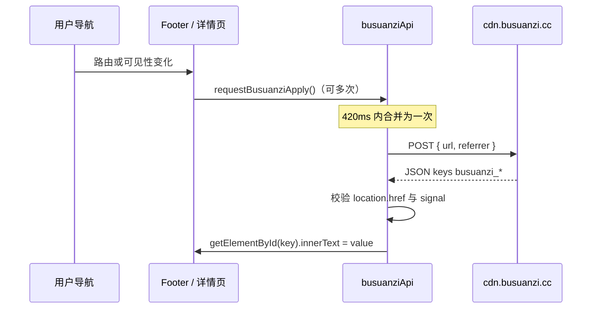

# 不蒜子（Busuanzi）接入说明

## 概述

说明如何在 **不挂载官方 `busuanzi.min.js`** 的前提下，用自研 `requestBusuanziApply()` 复现不蒜子 CDN 的 POST 行为，使 Vue SPA 在**路由切换后仍能更新统计**，并与页脚全站数据、详情页「本页阅读量」共用同一套逻辑。

## 前置条件

| 项目 | 说明 |
|------|------|
| 模块路径 | `src/utils/busuanziApi.js` |
| 调用方 | `src/components/FooterSection.vue`（`refreshBusuanzi`）、`src/views/ProjectDetail.vue`、`src/views/ShareDetail.vue`（均在内容就绪后的流程末尾触发） |
| 网络 | 需能访问 `https://cdn.busuanzi.cc/api.php`（第三方统计；合规需在隐私政策中披露） |
| DOM | 页面须预先存在与接口返回 key 同名的元素 `id`（如 `busuanzi_site_pv`） |

## 快速开始

接入新页面时只需两处：**模板里预留带固定 `id` 的空节点**，脚本侧在适当时机调用 `requestBusuanziApply()`。

```vue
<template>
  <!-- 使用 v-once 的空节点，避免 Vue 后续覆盖不蒜子写入的 innerText -->
  <span id="busuanzi_page_pv" v-once class="page-pv-num" aria-live="polite" />
</template>

<script setup>
import { requestBusuanziApply } from '@/utils/busuanziApi'
import { nextTick, onMounted } from 'vue'

onMounted(async () => {
  await nextTick()
  requestBusuanziApply()
})
</script>
```

同一导航瞬间多次调用会被合并为一次实际 POST（见下文「核心概念」）。

## 核心概念

结论：官方脚本为一次性 IIFE，SPA 内多次导航不会重复请求；本站改为**显式 POST**，并用 **debounce + in-flight 共用 + AbortController** 避免重复计数与旧响应污染新页面。



- **写 DOM**：仅处理键名匹配 `^busuanzi_[a-z0-9_]+$` 的字段；使用 `innerText` 降低异常 payload 的 XSS 面（仍依赖服务商返回可信文本）。
- **丢弃过期响应**：写回前若 `signal.aborted` 或 `location.href` 已变化，则放弃结果。

## 详细配置

### `busuanziApi.js` 常量

| 名称 | 类型 | 值 | 说明 |
|------|------|-----|------|
| `BUSUANZI_API_URL` | `string` | `https://cdn.busuanzi.cc/api.php` | 官方接口地址 |
| `DEBOUNCE_MS` | `number` | `420` | Trailing debounce 窗口，合并短时间多次触发 |

### 请求体（JSON）

| 字段 | 类型 | 说明 |
|------|------|------|
| `url` | `string` | 发起请求时的 `location.href` |
| `referrer` | `string` | `document.referrer`，无则为 `''` |

### 页脚相关 DOM 与缓存（`FooterSection.vue`）

| `id` | 用途 |
|------|------|
| `busuanzi_site_pv` | 全站 PV 写入槽位 |
| `busuanzi_today_uv` | 当日 UV 写入槽位 |

页脚在延迟读取上述节点文本后，将数字写入 localStorage 键 `footer_busuanzi_cache_v1`，用于失败降级与多语言格式化展示。

### 详情页本页阅读量

| 路由 | 文件 | 节点 `id` |
|------|------|------------|
| `/project/:id` | `ProjectDetail.vue` | `busuanzi_page_pv` |
| `/share/:slug` | `ShareDetail.vue` | `busuanzi_page_pv` |

> ⚠️ **注意**：不要在 `busuanzi_page_pv` 内放占位符文本（如 `--`）。部分环境下子节点非空会导致脚本无法覆盖；占位样式可用 `:empty::before` 等方式由 CSS 提供。

### 触发 `refreshBusuanzi` / `requestBusuanziApply` 的时机（页脚）

- 组件挂载（先 hydrate 缓存再刷新）
- `route.fullPath` 变化
- `visibilitychange === 'visible'`
- `pageshow`（含往返缓存）

**不再使用**定时器周期性刷新，以免长停留重复计 PV。

## 代码示例

### 示例 1：与异步正文加载协同（与栈迹文库一致的思想）

在 `fetchMarkdown` 的 `finally` 中先结束 loading，再 `nextTick` 后请求统计，保证 DOM 与布局稳定：

```javascript
import { requestBusuanziApply } from '@/utils/busuanziApi'
import { nextTick } from 'vue'

async function fetchMarkdown() {
  try {
    // ... 拉取并渲染 markdown
  } finally {
    loading.value = false
    await nextTick()
    requestBusuanziApply()
  }
}
```

### 示例 2：仅调试网络层时用 curl（勿用于生产伪造 PV）

本地排查连通性时可模拟 POST（真实计数仍以浏览器端完整流程为准）：

```bash
$ curl -sS -X POST "https://cdn.busuanzi.cc/api.php" \
  -H "Content-Type: application/json" \
  -d "{\"url\":\"https://example.com/foo\",\"referrer\":\"\"}"
```

输出为 JSON；键名需与页面上的 `id` 对应才会被脚本写入。

## 常见问题

**短时间内 PV 暴增？**  
检查是否在多个 `watch`/生命周期里重复调用且无防抖；应统一走 `requestBusuanziApply()`，避免绕过模块直接 `fetch`。

**切换路由后数字闪回旧值？**  
旧请求应在导航时被 `AbortController` 中止；若仍复现，确认是否使用了缓存 UI 逻辑未与当前路由键同步。

**本地开发域名统计异常？**  
不蒜子对本地/IP 访问可能有单独策略；页脚若读取到说明类文案会原样展示（见组件内注释）。

**能否只为详情页统计、不要页脚？**  
可以，但不挂载 Footer 时缺少 `busuanzi_site_pv` 等节点，全站类字段不会展示；单页字段只要存在对应 `id` 仍会写入。

## 延伸阅读

- 不蒜子服务以服务商最新说明为准（计数规则、隐私条款）  
- [MDN：Fetch API](https://developer.mozilla.org/zh-CN/docs/Web/API/Fetch_API) — `AbortController` 与请求中止  
- [Vue Router](https://router.vuejs.org/zh/) — SPA 导航与 `route` 监听  
- 站内：`docs/technical/Vite与Vue3-SPA架构.md`、`docs/technical/栈迹文库-Markdown与Mermaid.md`
