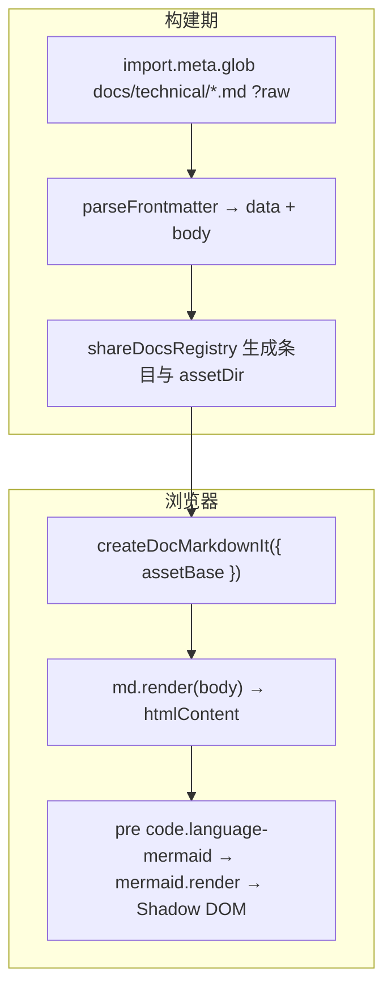
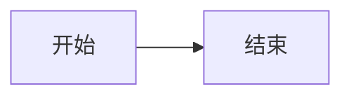

# 栈迹文库正文管线：Markdown、Mermaid 与样式

把 `docs/technical/*.md` 编成站内「栈迹文库」页面：原文在构建期由 `src/data/shareDocsRegistry.js` 里对 `../../docs/technical/*.md` 的 `import.meta.glob(..., { query: '?raw', eager: true })` 打包进前端（与学习足迹的 `projects.json` + `projects/*.md` 是两套数据源）。页面里用 `markdown-it` 渲染、`highlight.js`（GitHub 浅色 / 深色主题）做代码高亮，Mermaid 在挂载后再异步绘成 SVG，并与顶栏亮暗切换联动。

## 动手试一下

本地启动后打开任意一篇文档（`/share/<slug>`，`slug` 来自 frontmatter）：

```bash
$ npm install
$ npm run dev
```

终端里会给出本地地址（多为 `http://localhost:5173`）。文中写 ` ```js `、` ```vue `（Vue SFC 按 JavaScript 规则着色以便脚本区可读）等带语言标记的围栏代码块即可得到与 GitHub 相近的着色；` ```mermaid ` 会渲染成图。

## 正文是如何生成的

构建期把 Markdown 打进 bundle，运行时只做解析与增量替换，避免把 Mermaid 计算放在首屏关键路径上。



- **收录**：`README.md`、以及 frontmatter 里 `published: false` 的文档不会出现在列表。其余 `.md` 平铺在 `docs/technical/`。
- **相对图片**：`assetDir` 指向该文件所在目录，用于拼 ``。
- **Mermaid**：路由快速切换时用代际计数丢弃过期的异步渲染结果。

## Frontmatter 与写作约定

每个文档顶部用 `---` 写 YAML（解析器较简单，复杂结构请拆字段）。

| 字段 | 含义 |
|------|------|
| `title` | 列表与详情标题 |
| `slug` | URL 段，建议固定以便外链长期有效 |
| `description` | 摘要 |
| `date` | 排序用 |
| `tags` | 标签 |
| `category` | 分类（列表筛选用；扁平目录时也可只靠此项） |
| `published` | `false` 则整篇隐藏 |
| `order` | 同日排序的次要键 |

`createDocMarkdownIt({ assetBase })` 里的 `assetBase` 即上面的 `assetDir`。

> ⚠️ `MarkdownIt` 开启了 `html: true`。正文应只来自仓库内可信 Markdown；若将来接入不可信来源，需关闭 HTML 或先做净化。

## 示例：新增一篇最小文档

在 `docs/technical/示例主题.md`（文件名随意，建议中文或可读英文名）中写入：

````markdown
---
title: "示例主题"
slug: my-topic
description: "一句话摘要"
date: "2025-11-01"
tags: ["示例"]
category: engineering
published: true
order: 10
---

## 第一节

正文与 `行内代码`。

```javascript
export function hello(name) {
  return `Hello, ${name}`
}
```


````

保存后重新构建或刷新开发服务，访问 `/share/my-topic`。

## 心智模型：注册表里的每一条

```javascript
// 与 shareDocsRegistry.js 思路一致（示意）
const entry = {
  slug: data.slug || basename,
  title: data.title || basename,
  description: data.description || '',
  date: data.date || '',
  tags: normalizeTags(data.tags),
  order: typeof data.order === 'number' ? data.order : 0,
  category: data.category || inferCategoryFromPath(path),
  pathKey: normalizedKey,
  raw: rawText,
  body,
  assetDir,
}
```

## 常见问题

**目录里为什么只有部分标题？**  
TOC 只收集 `h2`～`h4`。层级尽量连续使用 `##`、`###`。

**切换深色后 Mermaid 闪一下？**  
会重新执行 `md.render` 与图表渲染，以保证与 `.dark` 配色一致。

**图片 404？**  
确认图片相对路径相对当前 `.md` 所在文件夹；资源放在同目录或子目录下。

## 延伸阅读

- [Markdown It API](https://github.com/markdown-it/markdown-it/blob/master/docs/api.md)
- [Mermaid](https://mermaid.js.org/)
- [highlight.js](https://highlightjs.org/)
- 站内：[Vite与Vue3-SPA架构.md](./Vite与Vue3-SPA架构.md)、[不蒜子接入说明.md](./不蒜子接入说明.md)
