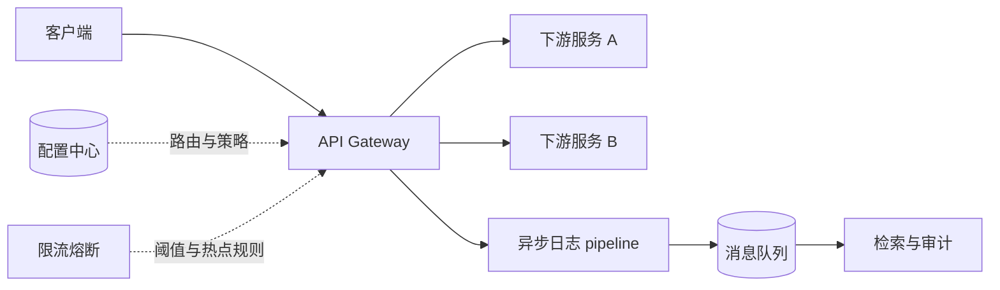

# 微服务统一接入：网关治理与可观测性栈（概念说明）

## 概述

用一篇与具体厂商版本解耦的**架构说明**，帮助读者理解「南北向流量统一接入 + 限流熔断 + 配置下发 + 异步可观测」的典型分工，并对照学习足迹中的大屏与审计叙事。

## 前置条件

| 项目 | 说明 |
|------|------|
| 读者背景 | 熟悉 HTTP、反向代理、消息队列的基本概念即可 |
| 本文范围 | **概念与拓扑**，不包含本仓库或任一生产环境的真实 IP、路由表、凭证 |
| 常见技术栈（示例名） | Spring Cloud Gateway、Sentinel、Nacos、Kafka/RocketMQ 等，实际选型以项目为准 |

## 快速开始

无本地运行步骤。建议阅读顺序：**核心概念**中的拓扑图 → **详细配置**中的职责表 → 对照你负责的网关控制台截图或监控大屏。

若需动手实验，可在本地用 Docker 拉起最小 Gateway + 下游演示服务（具体 Compose 以官方文档为准），不在本文展开。

## 核心概念

结论：**入口层只做「收口 + 策略执行 + 可观测出口」**，业务状态仍在领域服务内；日志与指标通过异步链路削峰。



- **Gateway**：TLS、路由、鉴权插件链、统一错误体；对外域名与证书尽量收敛于此。
- **Sentinel 等**：QPS/并发、慢调用降级、热点参数限流；与网关超时联动。
- **配置中心**：路由与策略版本化、监听热更新，避免「改阈值必须发版」。
- **异步日志 + MQ**：主链路非阻塞写审计流水；下游索引与检索与实时请求解耦。

## 详细配置

下文用「角色—典型配置项」描述；**默认值为行业常见起步值，仅作阅读锚点，落地前必须压测校准**。

### Gateway（API 网关）

| 参数/概念 | 类型/范围 | 典型默认（示意） | 说明 |
|-----------|-----------|------------------|------|
| 路由 `id` | `string` | 业务语义命名 | 便于变更审计 |
| `Path` 断言 | Ant/正则 | `/api/**` | 与下游 `context-path` 对齐 |
| 超时 | `ms` | `3000`–`8000` | 比下游最长 P99 略长，并小于客户端超时 |
| 重试 | `boolean`/次数 | 读接口少量重试；写接口默认关闭 | 避免放大故障 |

### 限流熔断（Sentinel 或等价）

| 参数/概念 | 类型 | 典型默认（示意） | 说明 |
|-----------|------|------------------|------|
| QPS 阈值 | `number` | 按容量规划 | 入口与下游分别设「入口总闸」与「服务细粒度」 |
| 慢调用比例 | `ratio` | 按 SLI | 触发熔断前观察窗口需足够大 |
| 降级响应 | `body`/错误码 | 业务约定 | 与网关统一错误封装一致 |

### 配置中心（如 Nacos）

| 参数/概念 | 说明 |
|-----------|------|
| `DataId` / `Group` | 与网关路由片段一一对应或按域划分 |
| 发布形态 | 灰度命名空间、标签路由，支持先小流量再全量 |

### 异步日志与检索

| 参数/概念 | 说明 |
|-----------|------|
| 队列分区 | 按租户或 trace 维度分区，避免热点单分区 |
| 消费并行度 | 与下游 ES/ClickHouse 写入能力匹配，避免反压回网关 |

> ⚠️ **注意**：本文不涉及真实密钥、VPC 与防火墙策略；生产变更需在变更管理系统中留痕。

## 代码示例

### 示例 1：在架构评审表里描述一条路由（注释说明字段）

以下 YAML **仅为说明性片段**，非可直接运行的 Spring Cloud Gateway 完整配置：

```yaml
# 示例：将 /orders/** 转发到订单服务集群
spring:
  cloud:
    gateway:
      routes:
        - id: order-service           # 路由标识，用于日志与运维检索
          uri: lb://order-service     # 通过注册发现负载均衡
          predicates:
            - Path=/orders/**         # 对外路径模式
          filters:
            - StripPrefix=1           # 去掉前缀再转发（按下游约定调整）
```

每一步意图：`id` 可读；`uri` 指向服务名；`Path` 对外契约；`StripPrefix` 对齐下游 Controller 路径。

### 示例 2：把「可观测」拆成三类信号（工程 checklist）

```text
1. Metrics：QPS、错误率、延迟直方图 —— 对应大屏曲线与告警。
2. Logs：请求 id、用户/租户 id、路由 id —— 对应审计与排障。
3. Traces：网关 span 与下游 span 关联 —— 对应端到端延迟分解。
```

实现上不绑定语言：关键是 **TraceId 在网关注入并向下传递**。

## 常见问题

**网关层和业务层谁该做鉴权？**  
对外认证（JWT、mTLS、API Key）通常在网关或专用 Auth 服务完成；细粒度授权仍在领域服务，避免网关堆积业务规则。

**配置中心与 GitOps 冲突吗？**  
不必然。可将真相源放在 Git，通过流水线同步到配置中心；或网关仅消费配置中心，由自动化保证一致性。

**异步日志会不会丢数据？**  
依赖 MQ 持久化与消费者幂等；关键金融审计需单独讨论「至少一次」与对账补偿。

**哨兵限流和网关限流重复吗？**  
可以分层：网关做粗粒度总闸，服务侧做资源隔离；阈值需联合测算，避免互相「误杀」。

## 延伸阅读

- [Spring Cloud Gateway](https://spring.io/projects/spring-cloud-gateway) — 路由模型与过滤器链  
- [Sentinel](https://sentinelguard.io/zh-cn/) — 流量控制与熔断降级  
- [Nacos](https://nacos.io/) — 动态配置与服务发现  
- OpenTelemetry 通用概念（分布式追踪）— 检索最新官方文档以对接具体后端
