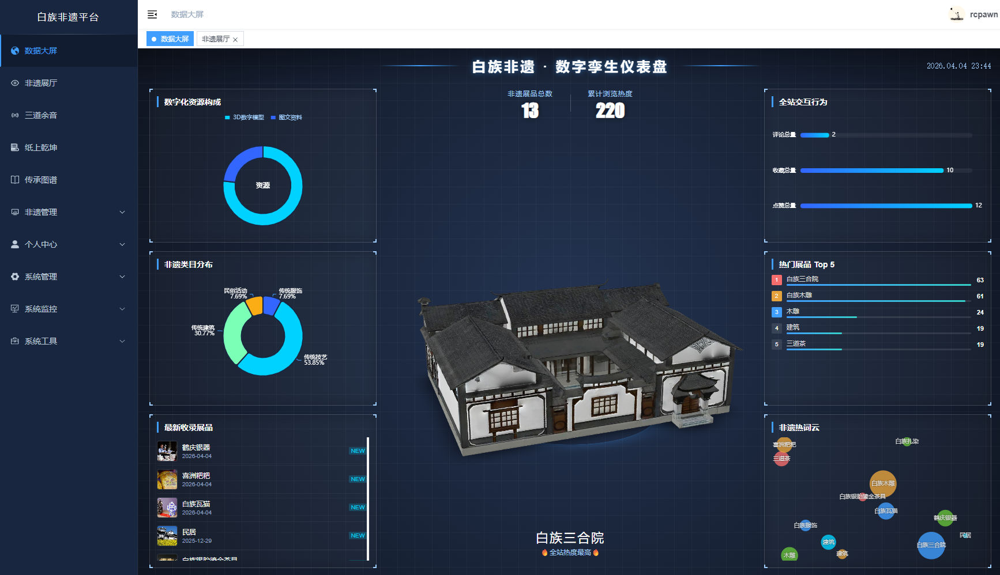
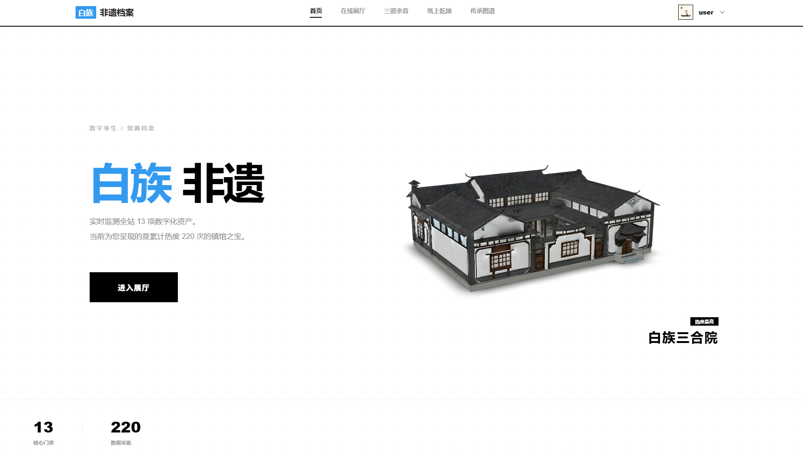
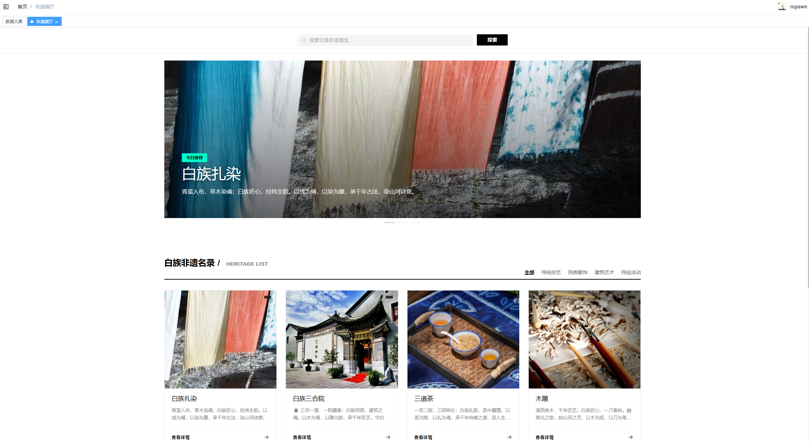
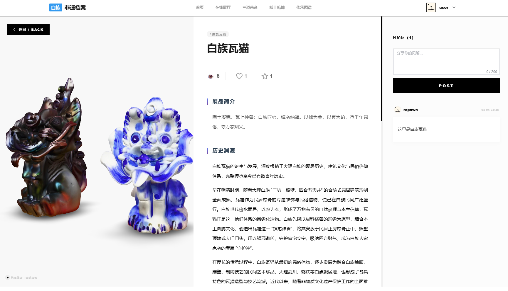
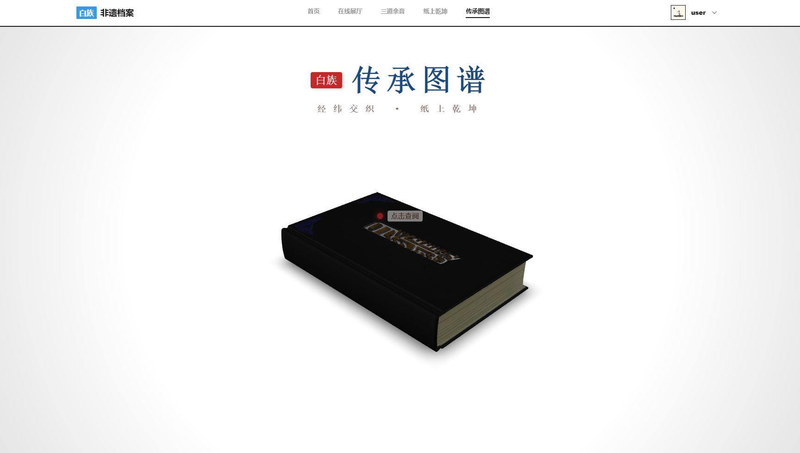
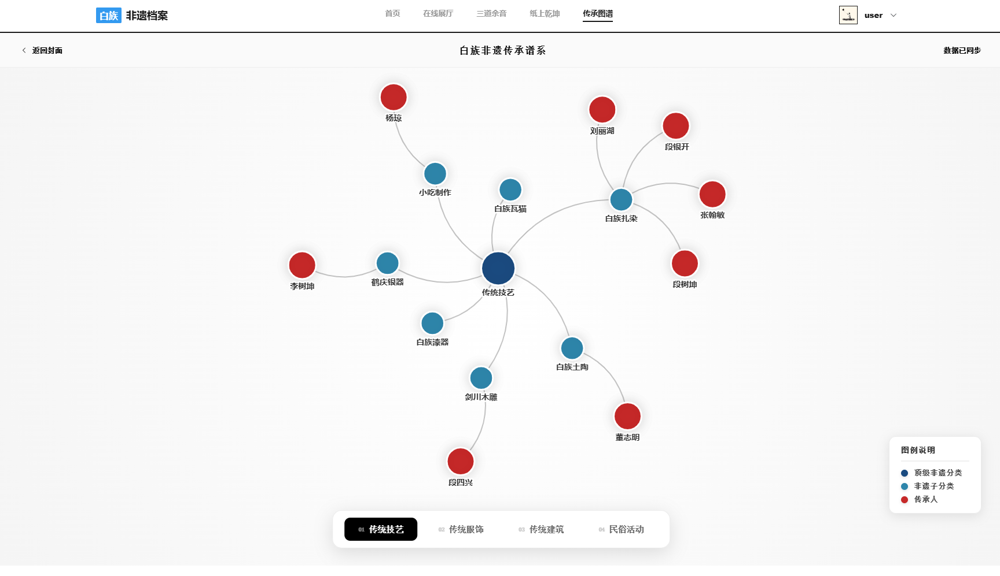
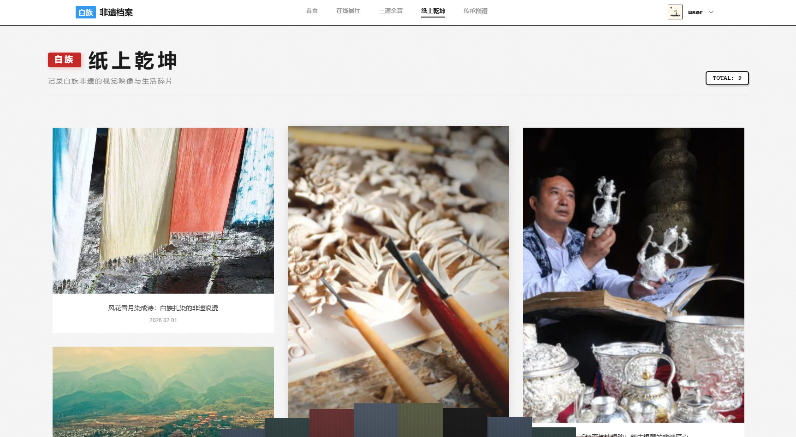
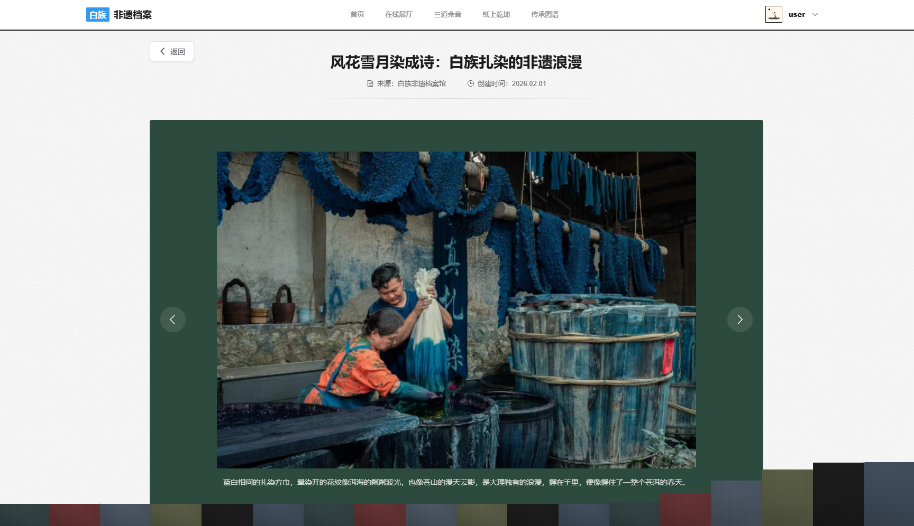

# 🏛️ 白族非遗数字博物馆

> **以数字之光照亮千年文脉，让传统技艺在云端永续传承**

<div align="center">

[](https://vuejs.org/)
[](https://spring.io/projects/spring-boot)
[](https://modelviewer.dev/)
[](https://echarts.apache.org/)
[](LICENSE)

</div>

---

## 📖 项目简介

**白族非遗数字博物馆**是一个融合 **3D 可视化、交互式展陈、数据驾驶舱** 于一体的非物质文化遗产数字化保护与展示平台。系统以大理白族传统文化为核心，通过现代 Web 技术将扎染、木雕、建筑、服饰等珍贵非遗资源进行数字化重构，打造沉浸式的线上文化体验空间。

### ✨ 核心理念

- 🎨 **数字孪生**：高精度 3D 模型还原非遗器物形态
- 📚 **活态传承**：图谱化呈现师徒传承脉络与技艺演进
- 📊 **数据赋能**：实时监测文化传播热度与用户行为
- 🌐 **开放共享**：UGC 内容生态促进全民参与文化保护

---

## 🎯 功能架构

```
📦 白族非遗数字博物馆
├── 🌏 数字驾驶舱          [✅ 已完成] 
│   ├── ECharts 多维数据可视化
│   ├── 3D 镇馆之宝展示
│   └── 实时统计面板
│
├── 🏛️ 在线展厅            [✅ 已完成]
│   ├── 分类筛选与智能搜索
│   ├── 3D 模型交互查看
│   └── 图文详情与社交互动
│
├── 📜 传承图谱            [✅ 已完成] 🌟 亮点
│   ├── 3D 翻书式交互设计
│   ├── 传承关系网络图
│   └── 传承人档案库
│
├── 📸 纸上乾坤            [✅ 已完成]
│   ├── 瀑布流图集展示
│   └── 沉浸式看图模式
│
├── 🎵 三道余音            [✅ 已完成]
│   ├── 音频播放与波形可视化
│   └── 唱词同步展示
│
├── 👤 个人中心            [✅ 已完成]
│   ├── 我的收藏 / 我的发布
│   └── 评论管理
│
└── 🛠️ 后台管理系统        [✅ 已完成]
    ├── 展品/传承人/分类管理
    ├── 审核中心
    └── 数据统计导出
```

---

## 🚀 核心功能详解

### 🌏 数字驾驶舱 - 数据总览中枢

> **"一屏观全域，一网管全局"**

数字驾驶舱作为系统的智慧大脑，通过 **ECharts 数据可视化 + 3D 场景融合** 技术，实时呈现非遗资源的分布态势与传播效果。

**核心指标：**
- 📊 非遗项目总量与分类占比
- 🔥 累计浏览热度与互动趋势
- 🏆 Top 5 热门藏品排行榜
- ☁️ 非遗热词云图
- 🎯 最新收录展品动态



---

### 🏛️ 前台首页 - 文化门户

> **"风花雪月入画来，白族文化触手可及"**

精心设计的门户页面，以极简美学呈现白族文化精髓，引导用户快速进入探索之旅。



---

### 🎪 在线展厅 - 3D 沉浸展陈

> **"指尖旋转千年工艺，屏幕触摸历史温度"**

基于 **Google Model Viewer** 构建的 3D 展品展示系统，支持：
- 🔄 360° 自由旋转与缩放
- 💡 真实光影渲染
- 📱 移动端适配
- ❤️ 点赞收藏与评论互动

**展品详情页优化：**
- 紧凑式统计数据展示（浏览量、点赞、收藏）
- SVG 矢量图标（爱心❤️ / 星星⭐），点击填充动画
- 渐变标题与圆角标签设计
- 响应式布局适配多端





---

### 📜 传承图谱 - 3D 翻书交互 🌟

> **"翻开历史的书页，看见传承的脉络"**

**创新亮点：** 采用 **3D 翻书模型** 作为交互载体，用户点击书本即可展开传承关系图谱，以力导向图形式呈现：
- 🧑‍🎨 传承人与其所属技艺分类
- 🌳 师徒传承关系链
- 🏅 国家级/省级/市级传承人分级标识
- 💬 悬浮信息卡片展示详细档案





---

### 📸 纸上乾坤 - 影像档案馆

> **"定格时光碎片，珍藏文化记忆"**

采用 **CSS Columns 瀑布流布局** 展示非遗摄影作品，支持：
- 🖼️ 自适应高度的卡片排列
- 🔍 点击进入沉浸式看图模式
- 📅 时间轴排序与元数据展示





---

### 🎵 三道余音 - 声音档案

> **"听见苍山洱海的回响"**

整合音频播放器与 3D 模型展示，实现视听融合的非遗体验：
- 🎧 自定义波形可视化
- 📝 唱词/解说文本同步
- 🎭 关联展品 3D 模型联动


---

## 🛠️ 技术栈

### 前端技术
| 技术 | 版本 | 说明 |
|------|------|------|
| Vue.js | 3.x | 渐进式 JavaScript 框架 |
| Vite | 4.x | 下一代前端构建工具 |
| Element Plus | 2.x | Vue 3 组件库 |
| Three.js | r150+ | 3D 渲染引擎 |
| @google/model-viewer | latest | Web 3D 模型查看器 |
| ECharts | 5.x | 数据可视化图表库 |
| Axios | 1.x | HTTP 客户端 |
| SCSS | - | CSS 预处理器 |

### 后端技术
| 技术 | 版本 | 说明 |
|------|------|------|
| Spring Boot | 2.5.x | Java 微服务框架 |
| MyBatis | 3.5.x | ORM 持久层框架 |
| Druid | 1.2.x | 数据库连接池 |
| JWT | 0.9.x | Token 认证 |
| MySQL | 8.0+ | 关系型数据库 |
| Redis | 6.x | 缓存数据库（可选） |

### 开发工具
- **IDE**: IntelliJ IDEA / VS Code
- **包管理**: Maven / npm
- **API 测试**: Postman / Apifox
- **版本控制**: Git

---

## 📦 快速开始

### 环境要求
- Node.js >= 16.0
- JDK >= 1.8
- MySQL >= 8.0
- Maven >= 3.6

### 后端启动

```bash
# 1. 克隆项目
git clone https://github.com/your-username/RuoYi-Vue.git

# 2. 导入数据库
mysql -u root -p < sql/current_all_table.sql

# 3. 修改配置
# 编辑 ruoyi-admin/src/main/resources/application.yml
# 配置数据库连接信息

# 4. 启动后端
cd RuoYi-Vue-master
mvn clean package
java -jar ruoyi-admin/target/ruoyi-admin.jar
```

### 前端启动

```bash
# 1. 进入前端目录
cd ruoyi-ui

# 2. 安装依赖
npm install

# 3. 启动开发服务器
npm run dev

# 4. 访问 http://localhost:80
```

### 默认账号
- 管理员：`admin` / `admin123`
- 普通用户：`user` / `admin123`

---

## 📂 项目结构

```
RuoYi-Vue-master/
├── ruoyi-admin/          # 后端主模块
│   ├── src/main/java/
│   │   ├── com.ruoyi.heritage/   # 非遗业务模块
│   │   │   ├── controller/       # 控制器
│   │   │   ├── service/          # 服务层
│   │   │   ├── mapper/           # 数据访问层
│   │   │   └── domain/           # 实体类
│   │   └── com.ruoyi.web/        # Web 配置
│   └── src/main/resources/
│       ├── mapper/heritage/      # MyBatis XML
│       └── application.yml       # 配置文件
│
├── ruoyi-ui/             # 前端主模块
│   ├── src/
│   │   ├── api/                  # API 接口
│   │   ├── views/                # 页面组件
│   │   │   ├── display/          # 前台展示
│   │   │   └── heritage/         # 后台管理
│   │   ├── components/           # 公共组件
│   │   └── router/               # 路由配置
│   └── vite.config.js            # Vite 配置
│
├── sql/                  # 数据库脚本
│   ├── current_all_table.sql     # 完整表结构
│   └── exhibition.sql            # 示例数据
│
└── profile/              # 静态资源
    ├── model/            # 3D 模型文件 (.glb)
    ├── image/            # 图片资源
    ├── audio/            # 音频文件
    └── video/            # 视频文件
```

---

## 🎨 设计亮点

### 1. 黑白极简美学
遵循 **白族"尚白"文化传统**，界面以黑白灰为主色调，辅以渐变色点缀，营造素雅清新的视觉体验。

### 2. 交互动画优化
- ❤️ 点赞心跳动画
- ⭐ 收藏闪烁效果
- 📖 3D 翻书过渡
- 🖼️ 图片懒加载与平滑滚动

### 3. 响应式设计
完美适配桌面端、平板、手机等多尺寸设备，确保最佳浏览体验。

### 4. 性能优化
- 3D 模型 GLB 格式压缩
- 图片懒加载与 CDN 加速
- 数据库索引优化
- Redis 缓存热点数据

---

## 📊 数据库设计

核心数据表：
- `heritage_item` - 非遗展品表
- `heritage_category` - 分类表
- `heritage_inheritor` - 传承人表
- `heritage_gallery` - 图集主表
- `heritage_gallery_image` - 图集从表
- `heritage_audio` - 音频档案表
- `heritage_user_action` - 用户行为记录表

详细 ER 图请参考 `sql/current_all_table.sql`

---

## 🤝 贡献指南

欢迎提交 Issue 和 Pull Request！

1. Fork 本仓库
2. 创建特性分支 (`git checkout -b feature/AmazingFeature`)
3. 提交更改 (`git commit -m 'Add some AmazingFeature'`)
4. 推送到分支 (`git push origin feature/AmazingFeature`)
5. 开启 Pull Request

---

## 📄 开源协议

本项目基于 [MIT License](LICENSE) 开源。

---

## 🙏 致谢

- [若依框架](http://www.ruoyi.vip/) - 优秀的后台管理系统脚手架
- [Google Model Viewer](https://modelviewer.dev/) - 强大的 Web 3D 模型查看器
- [ECharts](https://echarts.apache.org/) - 专业的数据可视化工具
- 云南网、中国非物质文化遗产网... - 提供非遗资料支持

---

## 📮 联系方式

如有问题或建议，欢迎通过以下方式联系：
- 📧 Email: your-email@example.com
- 💬 GitHub Issues: [提交问题](https://github.com/your-username/RuoYi-Vue/issues)

---

<div align="center">

**⭐ 如果这个项目对你有帮助，请给个 Star 支持一下！⭐**

Made with ❤️ by rcpawn

</div>
