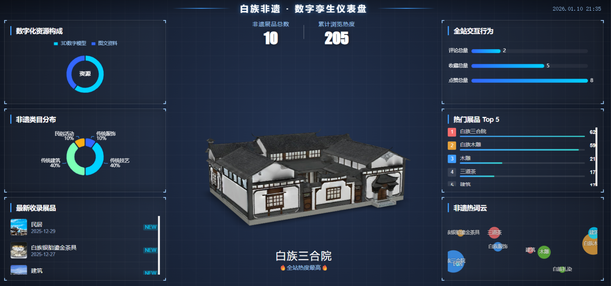
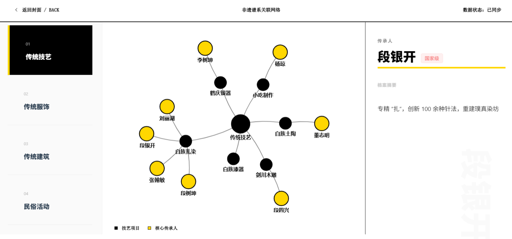

# 📦 非遗虚拟展陈与数据监测平台

## 🌏 数字驾驶舱

数字驾驶舱作为系统的**数据总览入口**，通过 **ECharts 数据可视化 + 3D 场景融合** 的方式，直观展示非遗资源的整体情况，包括：

- 非遗项目数量统计
- 分类分布情况
- 浏览热度与访问趋势
- 用户行为分析等关键指标

## 📜 传承图谱

传承图谱是用于展示非遗技艺传承关系的可视化模块，主要功能包括：

- 以非遗技艺为中心的传承关系网络展示
- 传承人、技法分支等多类型节点的关联呈现
- 支持点击节点查看传承人或技艺的详细信息

## 🎪 在线展陈

在线展厅是面向普通用户的核心展示模块，主要功能包括：

- 非遗展品卡片式列表展示
- 展品分类筛选与关键词搜索
- 展品详情页展示（模型展示 + 图文介绍 + 相关信息）

