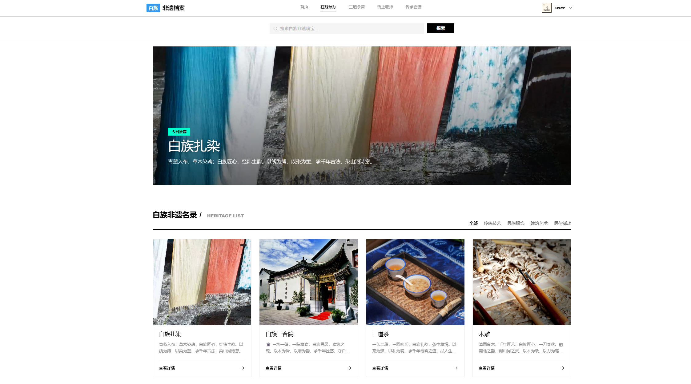
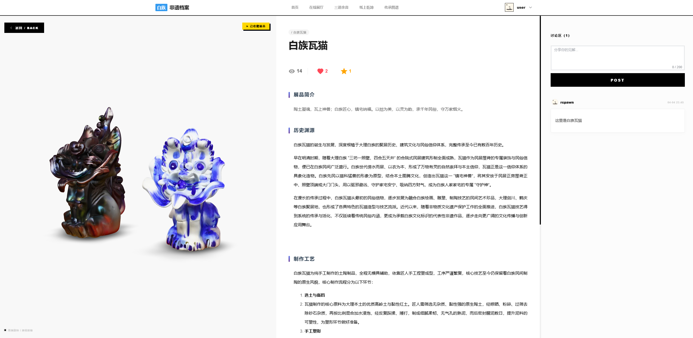
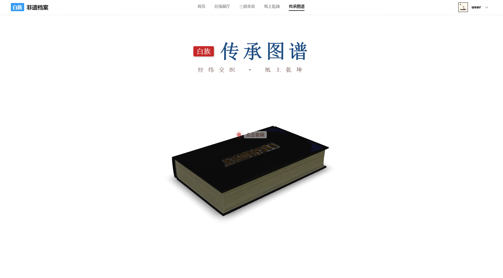
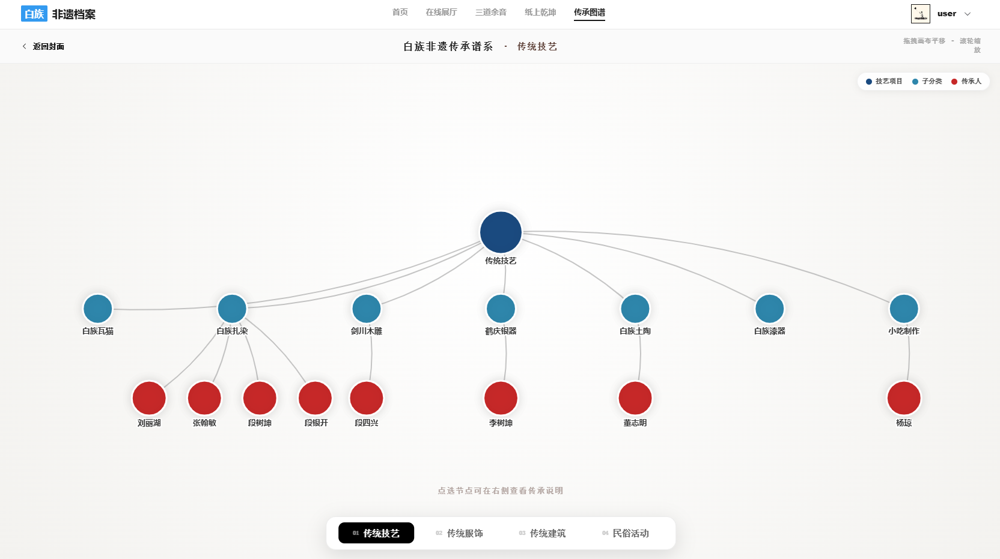
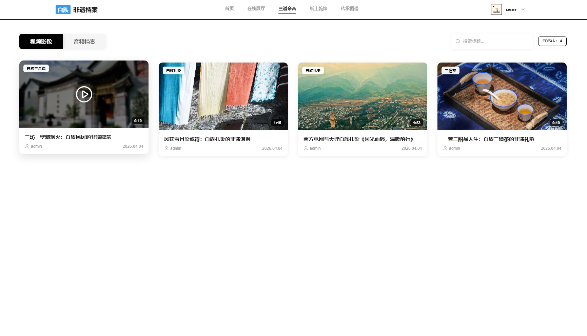

# 🏛️ 非遗虚拟展陈与数据监测平台

> 文化遗产数字化转型的 Web 3D 可视化探索

---

## 📖 项目概述

在文化遗产保护领域，如何将珍贵的非物质文化遗产进行数字化呈现，是技术人面临的挑战。本项目基于 Vue 3 + Spring Boot 技术栈，融合 **3D 可视化、交互式展陈、数据驾驶舱** 三大核心能力，打造白族非遗文化的数字孪生平台。

### 技术挑战与突破

- 🎨 **3D 沉浸体验**：基于 Google Model Viewer 实现展品 360° 交互展示
- 📜 **创新交互设计**：首创 3D 翻书式传承图谱，图谱化呈现师徒传承脉络
- 📊 **数据驱动决策**：ECharts 多维可视化，实时监测文化传播热度
- 🌐 **UGC 内容生态**：用户生成内容体系，促进全民参与文化保护

---

## 🏗️ 系统架构

### 整体架构

系统采用前后端分离架构，前端基于 Vue 3 + Vite 构建，后端采用 Spring Boot 微服务架构。

**核心模块**：
- 🌏 **数字驾驶舱**：数据总览中枢，ECharts 多维可视化 + 3D 场景融合
- 🏛️ **在线展厅**：3D 沉浸展陈，支持旋转缩放、点赞收藏互动
- 📜 **传承图谱**：3D 翻书交互设计，力导向图展示传承关系网络
- 📸 **纸上乾坤**：瀑布流影像档案馆，沉浸式看图模式
- 🎵 **三道余音**：音频播放与波形可视化，视听融合体验

```
📦 非遗虚拟展陈平台
├── 🌏 数字驾驶舱          [数据总览中枢]
├── 🏛️ 在线展厅            [3D 沉浸展陈]
├── 📜 传承图谱            [3D 翻书交互] 
├── 📸 纸上乾坤            [影像档案馆]
├──  三道余音            [声音档案]
└── ️ 后台管理系统        [内容管理]
```

---

## 🔍 核心功能实现

### 🌏 数字驾驶舱 - 数据总览中枢

**设计目标**："一屏观全域，一网管全局"

数字驾驶舱作为系统的智慧大脑，通过 **ECharts 数据可视化 + 3D 场景融合** 技术，实时呈现非遗资源的分布态势与传播效果。

**核心指标体系**：
- 📊 非遗项目总量与分类占比
- 🔥 累计浏览热度与互动趋势
- 🏆 Top 5 热门藏品排行榜
- ☁️ 非遗热词云图
- 🎯 最新收录展品动态


---

### 🏛️ 前台首页 - 文化门户

**设计理念**："风花雪月入画来，白族文化触手可及"

精心设计的门户页面，以极简美学呈现白族文化精髓，引导用户快速进入探索之旅。


---

### 🎪 在线展厅 - 3D 沉浸展陈

**技术创新**："指尖旋转千年工艺，屏幕触摸历史温度"

基于 **Google Model Viewer** 构建的 3D 展品展示系统，实现：
- 🔄 360° 自由旋转与缩放
- 💡 真实光影渲染
- 📱 移动端适配
- ❤️ 点赞收藏与评论互动

**展品详情页优化**：
- 紧凑式统计数据展示（浏览量、点赞、收藏）
- SVG 矢量图标（爱心❤️ / 星星⭐），点击填充动画
- 渐变标题与圆角标签设计
- 响应式布局适配多端





---

### 📜 传承图谱 - 3D 翻书交互 🌟

**核心亮点**："翻开历史的书页，看见传承的脉络"

**创新设计**：采用 **3D 翻书模型** 作为交互载体，用户点击书本即可展开传承关系图谱，以力导向图形式呈现：

- 🧑‍ 传承人与其所属技艺分类
- 🌳 师徒传承关系链
- 🏅 国家级/省级/市级传承人分级标识
- 💬 悬浮信息卡片展示详细档案





---

### 📸 纸上乾坤 - 影像档案馆

**视觉呈现**："定格时光碎片，珍藏文化记忆"

采用 **CSS Columns 瀑布流布局** 展示非遗摄影作品，支持：
- 🖼️ 自适应高度的卡片排列
- 🔍 点击进入沉浸式看图模式
- 📅 时间轴排序与元数据展示


---

### 🎵 三道余音 - 声音档案

**视听融合**："听见苍山洱海的回响"

整合音频播放器与 3D 模型展示，实现视听融合的非遗体验：
- 🎧 自定义波形可视化
- 📝 唱词/解说文本同步
- 🎭 关联展品 3D 模型联动



---

## 🛠️ 技术栈选型

### 前端技术
| 技术 | 版本 | 应用场景 |
|------|------|----------|
| Vue.js | 3.x | 渐进式 JavaScript 框架 |
| Vite | 4.x | 下一代前端构建工具 |
| Element Plus | 2.x | Vue 3 组件库 |
| Three.js | r150+ | 3D 渲染引擎 |
| @google/model-viewer | latest | Web 3D 模型查看器 |
| ECharts | 5.x | 数据可视化图表库 |
| Axios | 1.x | HTTP 客户端 |
| SCSS | - | CSS 预处理器 |

### 后端技术
| 技术 | 版本 | 应用场景 |
|------|------|----------|
| Spring Boot | 2.5.x | Java 微服务框架 |
| MyBatis | 3.5.x | ORM 持久层框架 |
| Druid | 1.2.x | 数据库连接池 |
| JWT | 0.9.x | Token 认证 |
| MySQL | 8.0+ | 关系型数据库 |
| Redis | 6.x | 缓存数据库 |

---

## 🎨 设计亮点

### 1. 黑白极简美学
遵循 **白族"尚白"文化传统**，界面以黑白灰为主色调，辅以渐变色点缀，营造素雅清新的视觉体验。

### 2. 交互动画优化
- ❤️ 点赞心跳动画
- ⭐ 收藏闪烁效果
- 📖 3D 翻书过渡
- 🖼️ 图片懒加载与平滑滚动

### 3. 响应式设计
完美适配桌面端、平板、手机等多尺寸设备，确保最佳浏览体验。

### 4. 性能优化
- 3D 模型 GLB 格式压缩
- 图片懒加载与 CDN 加速
- 数据库索引优化
- Redis 缓存热点数据

---

## 📊 数据库设计

核心数据表：
- `heritage_item` - 非遗展品表
- `heritage_category` - 分类表
- `heritage_inheritor` - 传承人表
- `heritage_gallery` - 图集主表
- `heritage_gallery_image` - 图集从表
- `heritage_audio` - 音频档案表
- `heritage_user_action` - 用户行为记录表

---

## 📝 总结与展望

### 技术收获

1. **3D 可视化实践**：深入掌握 Three.js 和 Model Viewer 的应用场景
2. **交互设计创新**：探索 3D 翻书式交互的新体验
3. **数据可视化能力**：ECharts 多维图表设计与实时数据更新
4. **文化遗产数字化**：理解文化保护与技术融合的意义

### 未来规划

- [ ] 支持多语言国际化，服务全球用户
- [ ] 引入 AR/VR 技术，增强沉浸感
- [ ] AI 智能推荐，个性化内容推送
- [ ] 社区化运营，UGC 内容生态完善

---

> 📖 本项目为文化遗产数字化保护的技术实践，代码与文档持续更新中。欢迎交流探讨！
