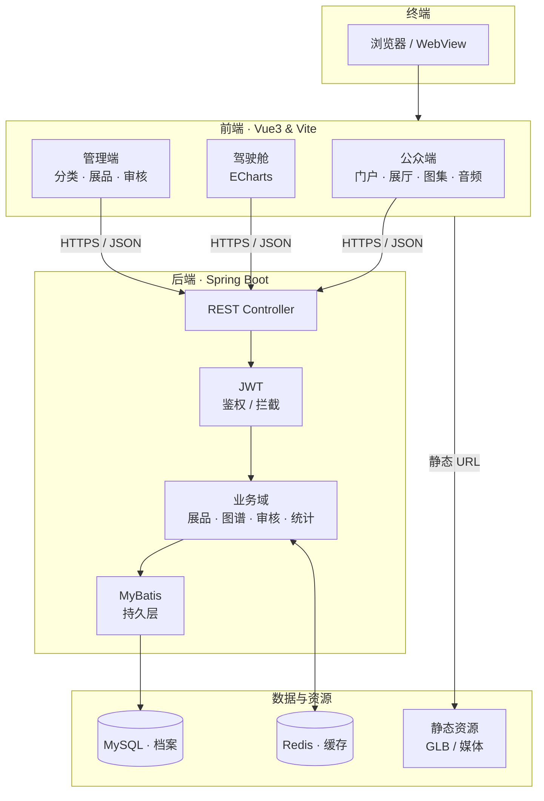
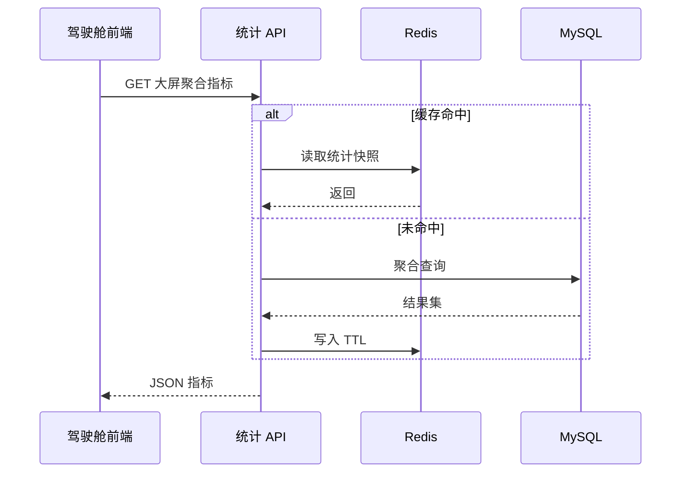
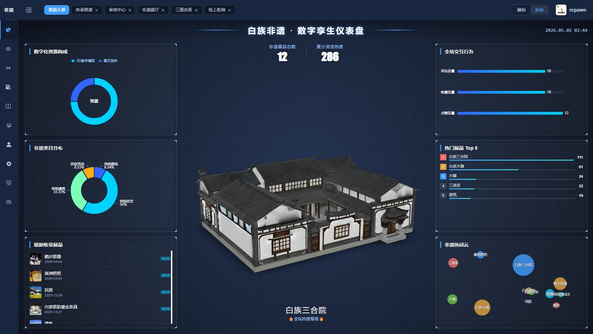
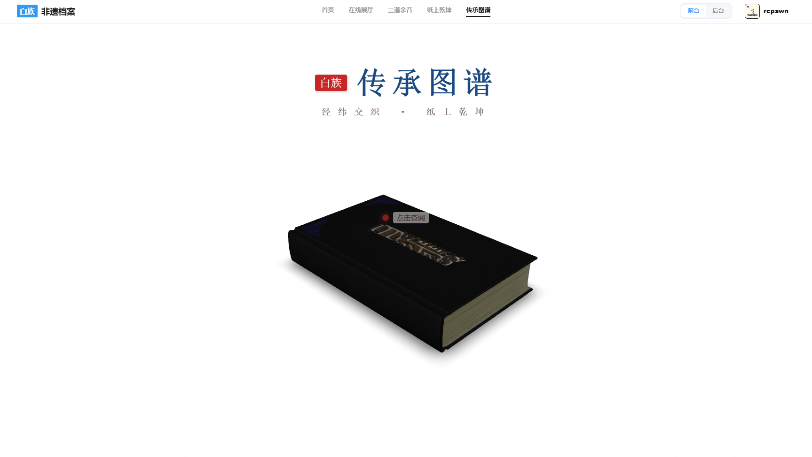
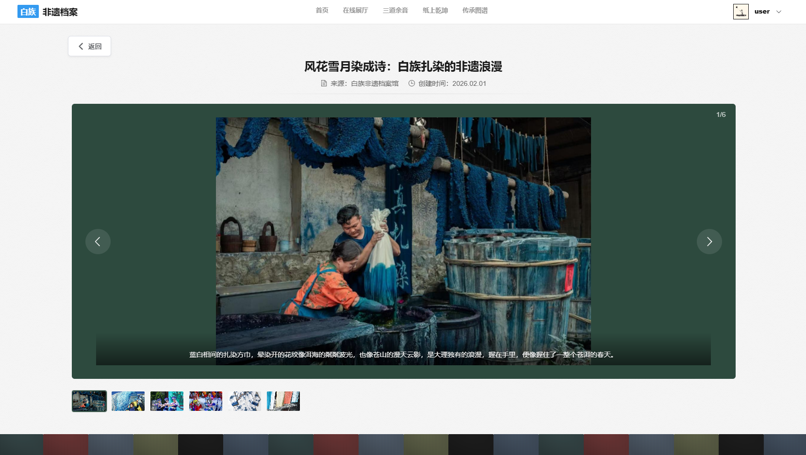
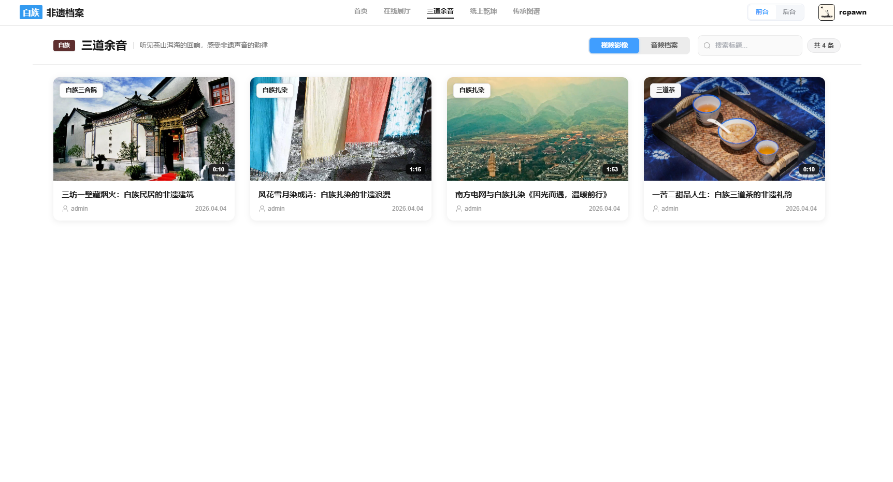
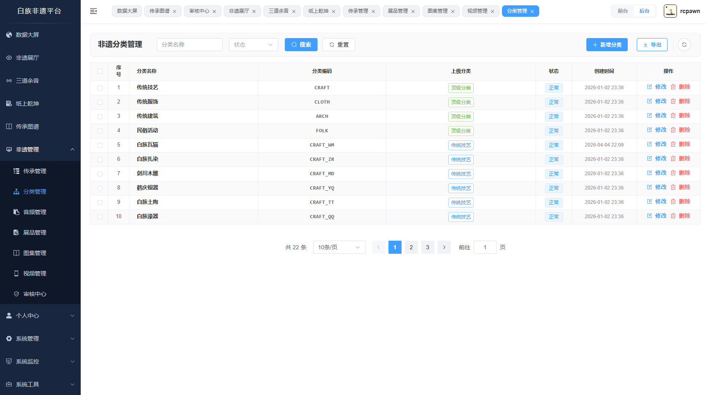
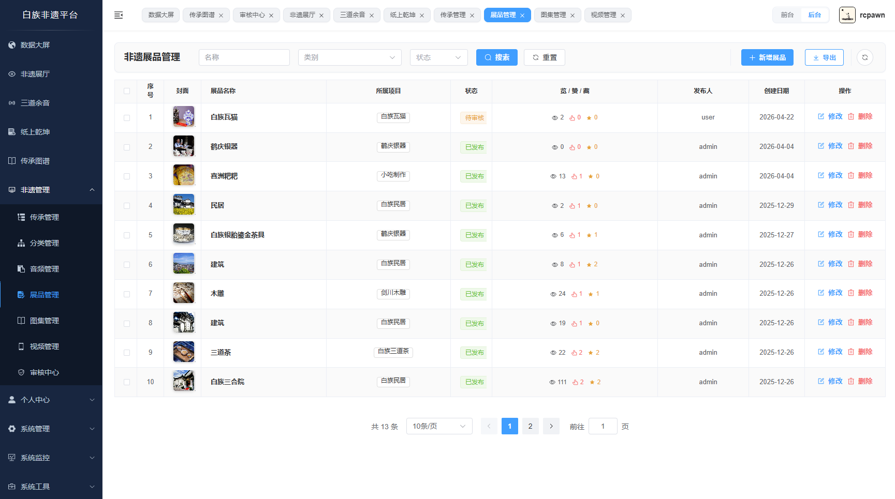
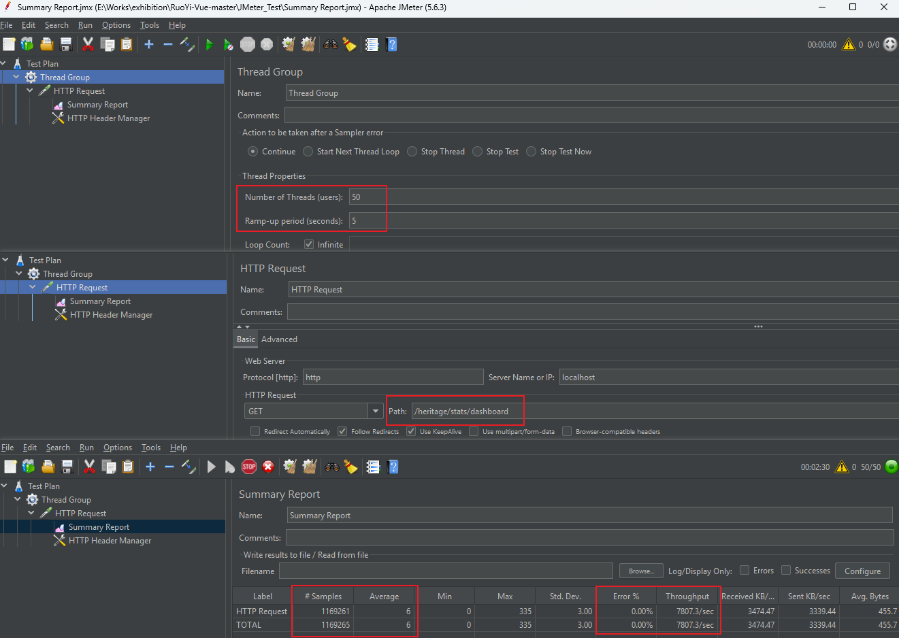

# 🏛️ 非遗虚拟展陈与数据监测平台

> 基于 Vue 3 与 Spring Boot 的展陈、图谱与数据可视化一体化实践，面向文化遗产数字化保护与传播。

---

## 📖 项目概述

本项目将白族非遗资源沉淀为可浏览、可检索、可统计的数字载体：前台侧重 **3D 展陈、传承图谱、影像与声音档案** 的沉浸式体验；后台支撑 **分类、展品、审核与内容运营**；监测层通过 **数字驾驶舱** 聚合指标，并对大屏依赖接口完成 **压测与量化**，便于上线与扩容决策。

### 能力一览

| 维度 | 说明 |
|------|------|
| 🎨 **3D 展陈** | 基于 Google Model Viewer，展品可旋转、缩放，适配多端 |
| 📜 **传承图谱** | 翻书式入口 + 力导向关系网络，呈现师徒与层级结构 |
| 📸 **纸上乾坤** | 瀑布流图集与沉浸式看图，兼顾检索与阅览节奏 |
| 🎵 **三道余音** | 音频档案与说明文案同屏，强化非遗听觉维度 |
| 📊 **数据驾驶舱** | ECharts 多维视图与热点趋势，服务运营与展示大屏 |
| 🌐 **门户与互动** | 文化门户导航、点赞收藏与评论等轻互动 |

---

## 🏗️ 系统架构

系统按 **终端 → 前端 SPA → HTTP API → 领域服务与持久化 → 缓存与静态资源** 分层拆分职责：公众浏览与管理运营共用同一后端，通过 **JWT + 权限模型** 区分路由；驾驶舱依赖的 **统计聚合接口** 走缓存热点路径，与 OLTP 写路径解耦；体积较大的 **GLB / 影像 / 音频** 走静态资源通道，减轻应用服务器字节流压力。

### 逻辑分层（前后端分离）

```mermaid
flowchart TB
  subgraph client["终端"]
    U["浏览器 / WebView"]
  end

  subgraph spa["前端 · Vue3 & Vite"]
    direction LR
    FE_P["公众端<br/>门户 · 展厅 · 图集 · 音频"]
    FE_D["驾驶舱<br/>ECharts"]
    FE_A["管理端<br/>分类 · 展品 · 审核"]
  end

  subgraph api["后端 · Spring Boot"]
    direction TB
    GW["REST Controller"]
    AUTH["JWT<br/>鉴权 / 拦截"]
    SVC["业务域<br/>展品 · 图谱 · 审核 · 统计"]
    DAO["MyBatis<br/>持久层"]
  end

  subgraph store["数据与资源"]
    direction LR
    MYSQL[("MySQL · 档案")]
    REDIS[("Redis · 缓存")]
    STATIC["静态资源<br/>GLB / 媒体"]
  end

  U --> spa
  FE_P -->|"HTTPS / JSON"| GW
  FE_D -->|"HTTPS / JSON"| GW
  FE_A -->|"HTTPS / JSON"| GW
  GW --> AUTH --> SVC --> DAO --> MYSQL
  SVC <--> REDIS
  spa -->|"静态 URL"| STATIC
```

**读图要点**：

- **横向**：同一 SPA 内划分公众、驾驶舱、管理端三类界面入口，共享 Axios 与路由守卫，但 **API 命名空间与权限要求不同**（匿名可读展品、写操作与审核需登录角色）。
- **纵向**：Controller 只做参数校验与编排；统计类接口在 Service 内聚合多表或预聚合结果，配合 **Redis** 降低驾驶舱轮询压力；大屏相关接口的容量边界见后文压测章节。
- **静态资源**：Model Viewer 加载的 GLB、瀑布流大图等优先走 **CDN / Nginx 静态目录**（图中统称静态资源），与 JSON API 分离，便于独立扩容与缓存策略。

### 驾驶舱数据流（简要）

驾驶舱刷新本质是「前端定时或触发拉取 → 统计接口 → 缓存命中则直接返回 → 未命中则读库聚合后回填缓存」。若需更强实时性，可在后续迭代引入消息队列或变更订阅，当前文档中的实现以 **可压测、可预期的 REST + Redis** 为主。

```mermaid
sequenceDiagram
  participant V as 驾驶舱前端
  participant B as 统计 API
  participant R as Redis
  participant M as MySQL

  V->>B: GET 大屏聚合指标
  alt 缓存命中
    B->>R: 读取统计快照
    R-->>B: 返回
  else 未命中
    B->>M: 聚合查询
    M-->>B: 结果集
    B->>R: 写入 TTL
  end
  B-->>V: JSON 指标
```

---

## 🔍 业务界面展示

以下按阅读优先级编排：**驾驶舱、门户与前台核心路径、压测报告** 独立成块并配以说明；**后台与内容运营** 相关界面以双栏汇总，避免冲淡主线叙事。

### 🌏 数字驾驶舱

驾驶舱承担「一屏读全局」的角色：项目与分类占比、访问与互动趋势、热门展品、热词与最新收录等，由后台统计接口聚合；图表选型与刷新频率需与接口性能匹配，后文 **大屏接口压测** 给出量化依据。

---

### 🏠 文化门户首页

门户负责品牌感与动线：从首页进入展厅、图谱、图集与音频等板块，信息层级以留白与留白间的节奏为主，避免在首屏堆叠过多运营文案。

---

### 🏛️ 在线展厅（3D 展陈）

展厅基于 **Model Viewer** 提供模型加载、环境光与触控/拖拽习惯；同一批展品可在列表与详情间跳转，详情页集中展示缩略信息、互动数据与评论入口，保证「先看物、再深读」的路径。

---

### 🖼️ 展品详情页

详情页压缩统计信息（浏览、点赞、收藏等）的布局噪声，采用一致的图标与标签体系，便于在投影或手机窄屏上仍能快速扫读。

---

### ❤️ 互动与收藏

点赞、收藏与会话内状态需与登录态及接口幂等策略一致；前端以清晰反馈（动画不宜过长）确认操作结果，减少误触焦虑。

---

### 📜 传承图谱（翻书入口）

传承图谱以 **3D 翻书** 作为隐喻入口：用户从「翻开」动作进入关系视图，比直白菜单更能传达「谱系」与「层递」的文化语义；交互需控制单次动画时长，兼顾展厅现场的连续演示。

---

### 🕸️ 传承关系网络

展开后以力导向图展示传承人、技艺分类与层级标签（如各级传承人）；节点悬浮信息承载档案摘要，复杂网络下需限制初始节点规模并提供分层或筛选，避免视觉糊成一团。

---

### 📸 纸上乾坤 · 图集浏览

图集采用 **CSS Columns** 等瀑布流策略，列宽随容器变化，卡片高度随素材纵横比变化，兼顾笔记本宽度与大屏浏览。

---

### 🔍 纸上乾坤 · 沉浸式看图

单张沉浸模式突出画幅与说明：可选叠底文案或侧栏元数据，与列表页形成「浏览 → 细读」两级节奏。

---

### 🎵 三道余音 · 声音档案

音频区集成播放控件与文案说明，可与关联展品或场景入口联动，形成视听互补的档案单元。

---

### 🛠️ 后台与内容运营（双栏）

分类树、展品字段与媒体资源、审核流转属于典型 **B 端高频路径**：此处采用双栏并列，便于技术文档读者快速扫一眼后台能力边界，而不占用与公众展示同等比例的篇幅。

|  |  |
|:--:|:--:|
| **分类管理** · 树形类目与展示顺序 | **展品管理** · 条目与媒体维护 |

|  |
|:--:|
| **审核中心** · 内容上架与风控流转 |

---

## ⚙️ 大屏接口压测说明

数字驾驶舱的卡片与图表依赖统计聚合接口（例如大屏场景的 `GET /heritage/stats/dashboard` 一类接口）。在集中参观或开幕式投影等情形下，接口需在有限硬件上保持稳定吞吐与低错误率。使用 **Apache JMeter 5.6.3** 配置线程组（如 **50 并发**、**5 秒** 爬坡）、HTTP 取样器与聚合报告，在百万级采样量级下观测到平均响应约 **6 ms**、吞吐量约 **7800+ 请求/秒**、**错误率 0%**，作为性能侧的支撑材料而非替代线上监控。

---

## 🛠️ 技术栈选型

### 前端

| 技术 | 版本 | 应用场景 |
|------|------|----------|
| Vue.js | 3.x | 渐进式 UI 框架 |
| Vite | 4.x | 构建与开发服务器 |
| Element Plus | 2.x | 组件库 |
| Three.js | r150+ | 三维辅助能力 |
| @google/model-viewer | latest | Web 端 GLB 模型展示 |
| ECharts | 5.x | 驾驶舱图表 |
| Axios | 1.x | HTTP 客户端 |
| SCSS | - | 样式预处理 |

### 后端

| 技术 | 版本 | 应用场景 |
|------|------|----------|
| Spring Boot | 2.5.x | 服务与集成 |
| MyBatis | 3.5.x | ORM |
| Druid | 1.2.x | 连接池 |
| JWT | 0.9.x | 认证 |
| MySQL | 8.0+ | 持久化 |
| Redis | 6.x | 缓存 |

---

## 🎨 设计与体验要点

1. **视觉基调**：以黑白灰为主、渐变点缀，贴合「尚白」审美倾向，避免抢眼配色干扰文物主体。
2. **动效节制**：点赞、收藏、翻书等动画保持可感知且短促，尊重 `prefers-reduced-motion` 场景。
3. **响应式**：门户与详情在笔记本高度与 27″ 大屏上均需限制主内容 `max-height` 与留白，避免一屏只剩半张图或按钮溢出（实现细则见项目内各页 `scoped` 样式约定）。
4. **性能**：GLB 压缩、图片懒加载、热点接口 Redis 缓存与数据库索引协同。

---

## 📊 数据库设计（摘录）

- `heritage_item` — 展品主数据  
- `heritage_category` — 分类  
- `heritage_inheritor` — 传承人  
- `heritage_gallery` / `heritage_gallery_image` — 图集  
- `heritage_audio` — 音频档案  
- `heritage_user_action` — 用户行为  

---

## 📝 小结与后续

**已沉淀能力**：3D 展陈链路、图谱交互、影像与音频两类非结构化资源、驾驶舱指标与 **JMeter 压测** 的可重复脚本化验证。  

**可演进方向**：国际化文案与路由；AR/VR 仅在确有展陈场地与带宽评估时引入；推荐与社区化需单独立项评估内容与合规。

---

> 本文为该项目的技术说明与界面索引，图片文件名已与仓库内 **中文规范命名** 的资源一一对应，便于运营与协作时检索替换。
