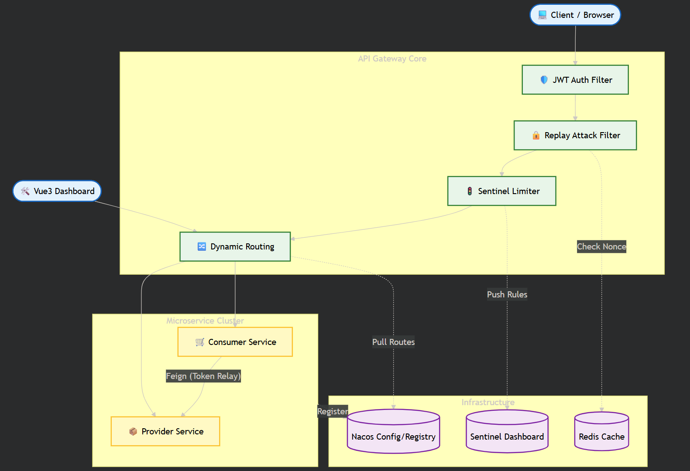
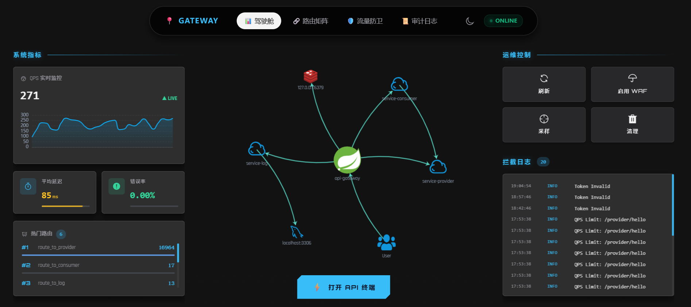
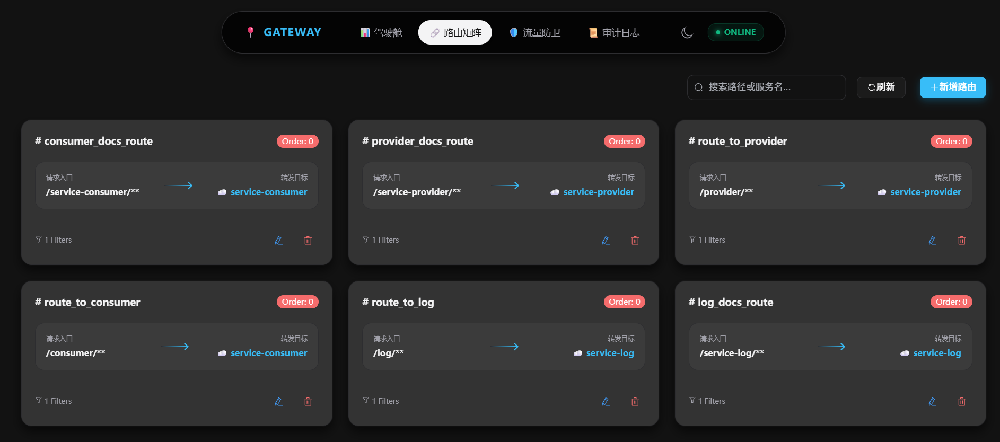
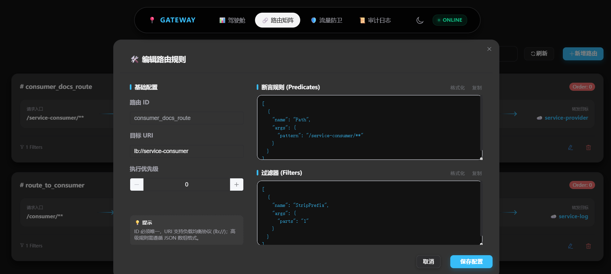
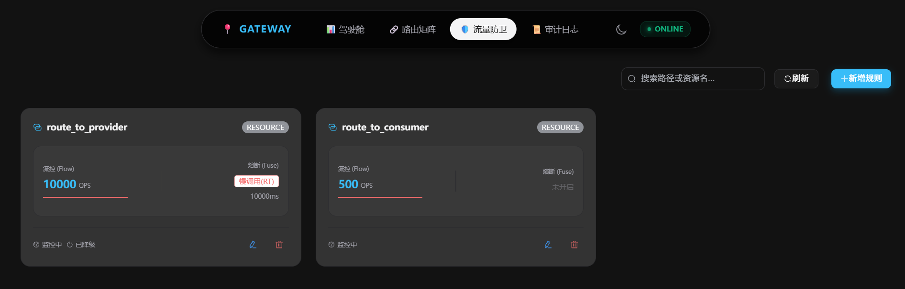
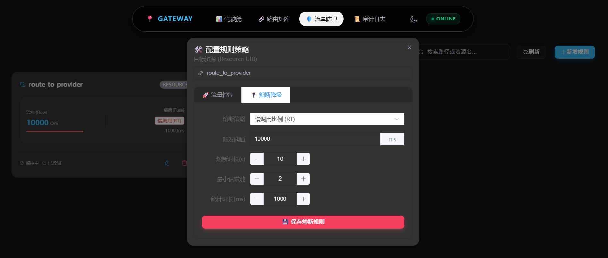
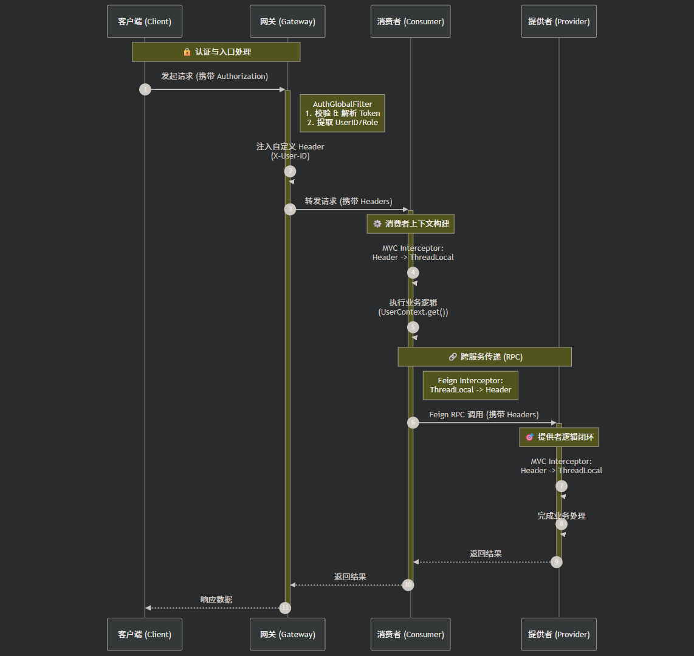
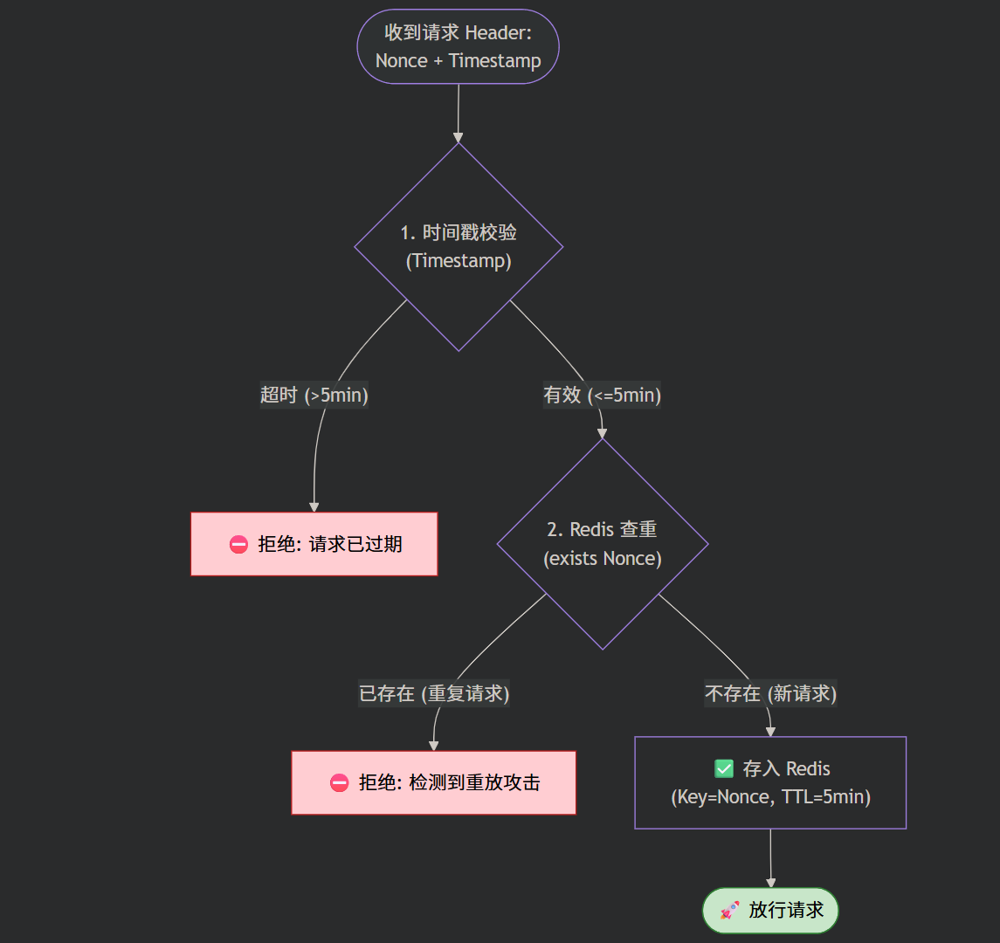
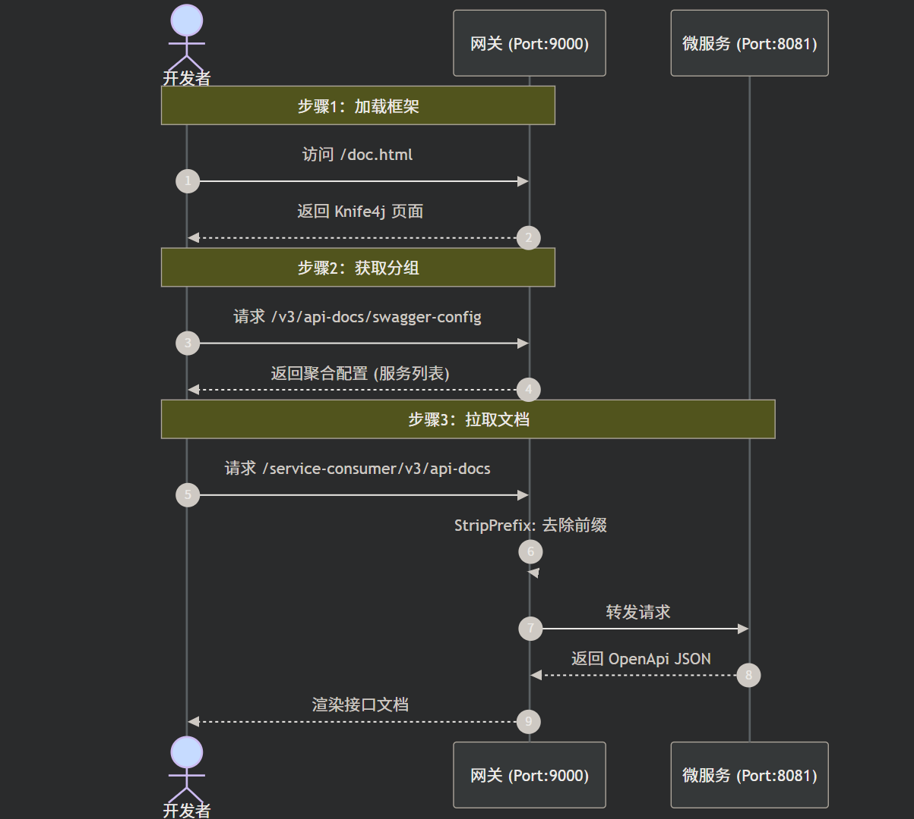
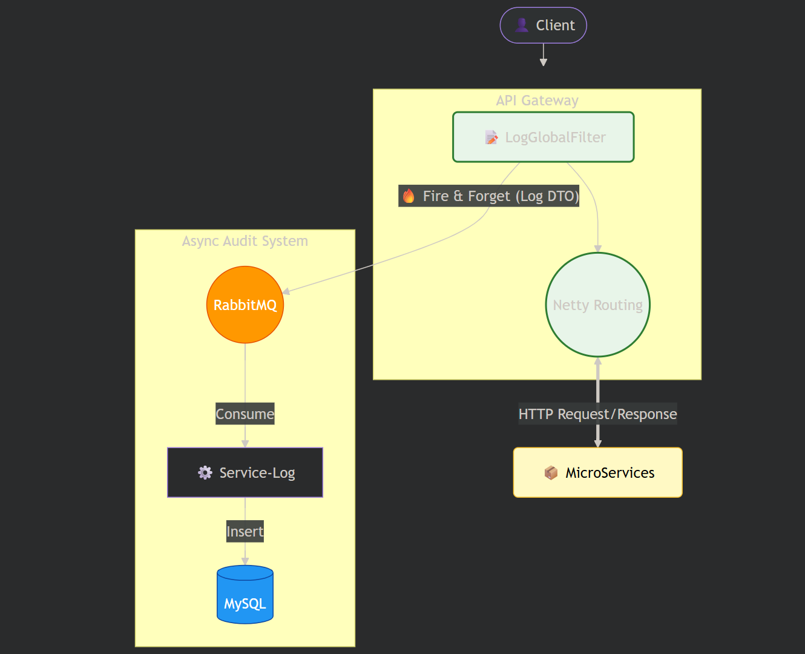

# 🛡️ Microservice Gateway Platform

> **微服务流量治理与统一接入平台**
>
> 自主研发的微服务网关平台，深度整合了**全链路鉴权**、**动态路由**、**流量治理**、**安全防御**、**异步日志**及**可视化配置与监控**，构建了安全可观测的流量入口。

---

## 🏗️ 1. 系统架构

网关基于 Spring Cloud Gateway 响应式框架构建，作为核心入口统一调度下游微服务。

---

## 💻 2. 流量驾驶舱与可视化配置

这是本系统的核心管理终端，实现了从“手写配置”到“图形化操作”的转变，提升了运维与开发效率。

- **实时流量监控**：直观展示网络拓扑、QPS、错误率及响应耗时等指标。
- **路由、流控、熔断在线治理**：可视化配置动态路由，限流、降级规则。

**测试数据说明**：

| 项目             | 详情                                                         |
| ---------------- | ------------------------------------------------------------ |
| **压测工具**     | Apache JMeter（Windows 图形界面版）                          |
| **压测并发**     | 30 个并发线程                                                |
| **网关部署**     | 运行于 Windows 宿主机的 Java 进程                            |
| **同时运行进程** | IntelliJ IDEA、Chrome 浏览器（多标签页）、网关依赖的中间件及数据库等环境进程 |
| **网络环境**     | 本机回环网络（127.0.0.1）                                    |

> 优化前（代码有阻塞逻辑，性能略低）：

> 优化后（待更新，网关性能应该是还可以，之前电脑状态好，测试能够几乎水平线稳定1000+）
>
> 注：限制 SkyWalking 采样率后性能有所提升，但这会导致出现 User -> service 的拓扑连线：

---

## 🌟 3. 核心特性

### 🚦 流量治理与动态配置

- **动态路由热更新**：基于 Nacos Config 监听机制，实现路由配置修改实时生效，避免了传统配置修改需重启网关的问题。
- **精细化限流熔断**：集成 Sentinel 实现了针对不同服务路径的限流保护，并自定义了标准化的 JSON 异常回执。

### 🛡️ 安全防御体系

- **防重放攻击**：利用 Redis 存储 Nonce + 时间戳校验，通过双重验证拦截恶意重复请求，增强了接口安全性。
- **全链路身份透传**：设计了“网关解析-拦截器注入-Feign透传”的闭环方案，确保 UserID 等信息在微服务调用链中无感知传递。
- **全局跨域支持**：统一处理 WebFlux 响应式环境下的 CORS 跨域问题。

### 📝 观测与审计

- **异步日志系统**：基于网关全局过滤器采集流量日志，通过消息队列解耦，由后台服务异步存库，确保不影响主链路性能。
- **API 文档聚合**：集成 Knife4j 自动发现下游微服务 Doc 资源，实现在网关入口统一查阅全量接口文档。

---

## 🔍 4. 关键技术原理

### 4.1 全链路 Token 透传流程

采用 `ThreadLocal` 结合 `Feign RequestInterceptor`。网关层负责身份校验与 Header 注入，业务层负责上下文获取。

### 4.2 防重放校验机制

1. **时间戳校验**：拦截超过 5 分钟的过期请求。
2. **Redis 查重**：验证 Nonce（唯一标识）是否存在，防止在有效期内的请求被二次利用。

### 4.3 接口文档聚合

网关作为流量入口，统一拦截 Swagger 资源请求，并根据路由规则重写路径，将下游微服务的文档数据聚合展示。

### 4.4 异步日志

---

  ## 🛠️ 5. 核心技术栈

  - **核心框架**：Spring Boot 3.x, Spring Cloud Gateway
  - **中间件**：Nacos 2.x (注册/配置), Sentinel, Redis, RabbitMQ
  - **远程调用**：OpenFeign
  - **前端生态**：Vue 3, Vite, Element Plus, ECharts

------

  ## 📖 6. 运行指引

  1. **环境启动**：启动 Nacos、Sentinel、SkyWalking、Redis、MySQL 及 RabbitMQ。
  2. **网关配置**：在 Nacos 中创建 `gateway-rules` 配置分组，用于存储动态路由 JSON。
  3. **服务接入**：微服务引入相关 Starter 并注册至 Nacos。
  4. **控制台访问**：启动 Vue 项目，通过 `localhost:5173` 进行网关监控与配置。
