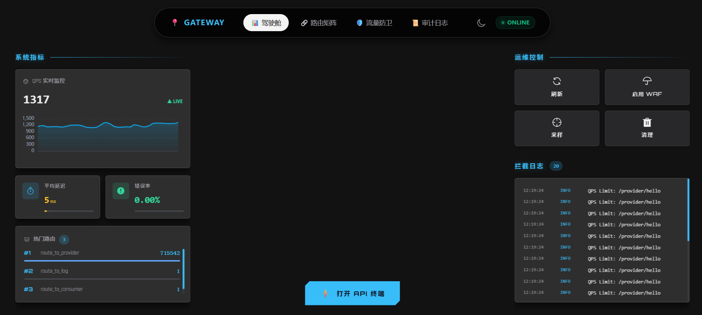
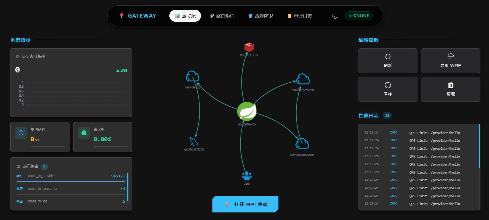

# 🛡️ Microservice Gateway Platform

> **微服务流量治理与统一接入平台**
>
> 自主研发的微服务网关平台，深度整合了**全链路鉴权**、**动态路由**、**流量治理**、**安全防御**、**异步日志**及**可视化配置与监控**，构建了安全可观测的流量入口。

---

## 🏗️ 1. 系统架构

网关基于 Spring Cloud Gateway 响应式框架构建，作为核心入口统一调度下游微服务。

---

## ⚡ 2. 性能压测报告

### 🖥️ 测试环境

> **注**：本次压测在 Windows 开发机上进行，采用 **单机全栈混部** 模式。网关、微服务、Redis、SkyWalking、JMeter 均运行在同一物理机上，存在严重的 CPU 时间片争抢与端口资源竞争。

| 组件         | 配置/版本                | 备注                                                         |
| :----------- | :----------------------- | :----------------------------------------------------------- |
| **CPU**      | Intel 4核                | CPU型号 i7-1165G7                                            |
| **内存**     | 24GB DDR4/5              | 网关 JVM 分配 4GB                                            |
| **网关**     | Spring Cloud Gateway 3.x | **开启** Sentinel 限流 + SkyWalking 探针 + Redis 全量埋点 + JWT 鉴权 |
| **下游服务** | Service-Provider         | 简单 Echo 接口，模拟微服务调用                               |
| **中间件**   | Redis 5.x + Nacos 2.x    | 单节点部署                                                   |
| **压测工具** | JMeter 5.x               | Windows 图形界面版，30 并发，无限循环，KeepAlive 开启        |

---

### 📊 性能对比与分析

在单机网络 I/O 翻倍（Gateway转发特性）及全链路治理组件开启的高负载下，经过非阻塞架构改造，网关吞吐量实现了质的飞跃。

| 阶段       | 峰值 QPS  | 稳定性                                                       | 瓶颈分析                                                     |
| :--------- | :-------- | :----------------------------------------------------------- | :----------------------------------------------------------- |
| **优化前** | 200 ~ 500 | ❌ **极不稳定** 运行 3 分钟后 QPS 断崖式下跌至 100 以内，伴随高延迟。 | **同步阻塞 I/O**：使用 `StringRedisTemplate` 阻塞 Netty 线程； **资源积压**：SkyWalking 采样率过高导致 OOM； **线程切换**：频繁自定义线程池切换导致 Context 丢失。 |
| **优化后** | **1300+** | ✅ **稳如泰山** 长时压测曲线平滑，无 Full GC，无延迟毛刺。 | **全链路异步**：切换 `ReactiveRedisTemplate` + Pipeline； **零拷贝**：移除多余对象创建； **反压保护**：优化 SkyWalking 采样率与 Netty 线程模型。 |

**📷 优化前截图 (阻塞/OOM)**：

**📷 优化后截图 (稳定 1300+)**：

### 📉 性能损耗漏斗分析

针对下游 Provider 直测 QPS 可达 **6500+**，而网关转发 QPS 为 **1300+** 的现象，经分析属于合理的**架构损耗**，具体拆解如下：

1.  **网络 I/O 翻倍 (50% 损耗)**：
    *   直连：`Client -> Provider` (1次交互)
    *   网关：`Client -> Gateway -> Provider -> Gateway -> Client` (2次完整交互，序列化/反序列化开销翻倍)。
    *   *理论上限：3250 QPS*
2.  **治理组件税收 (30% 损耗)**：
    *   **SkyWalking**：字节码增强、Trace Context 生成与跨进程传播。
    *   **Sentinel**：实时滑动窗口统计、规则校验。
    *   *理论上限：2275 QPS*
3.  **业务逻辑开销 (10% 损耗)**：
    *   **Redis**：每个请求触发 5+ 次异步埋点（QPS/Latency/TopN）。
    *   **JWT**：SHA256 验签计算。
    *   *理论上限：1820 QPS*
4.  **单机资源争抢 (20%~30% 损耗)**：
    *   JMeter 压测端与网关服务端抢占同一 CPU 资源，导致严重的 Context Switch。
    *   *实测结果：1300+ QPS*

> **结论**：在 Windows 单机混部且开启全套治理逻辑的前提下，**1300 QPS 代表了该硬件环境下非阻塞 IO 的性能极限**。若部署至 Linux 独立服务器，预计 QPS 可提升至 **10k+**。

---

## 💻 3. 流量驾驶舱与可视化配置

这是本系统的核心管理终端，实现了从“手写配置”到“图形化操作”的转变，提升了运维与开发效率。

- **实时流量监控**：直观展示网络拓扑、QPS、错误率及响应耗时等指标。
- **路由、流控、熔断在线治理**：可视化配置动态路由，限流、降级规则。

---

## 🌟 4. 核心特性

### 🚦 流量治理与动态配置

- **动态路由热更新**：基于 Nacos Config 监听机制，实现路由配置修改实时生效，避免了传统配置修改需重启网关的问题。
- **精细化限流熔断**：集成 Sentinel 实现了针对不同服务路径的限流保护，并自定义了标准化的 JSON 异常回执。

### 🛡️ 安全防御体系

- **防重放攻击**：利用 Redis 存储 Nonce + 时间戳校验，通过双重验证拦截恶意重复请求，增强了接口安全性。
- **全链路身份透传**：设计了“网关解析-拦截器注入-Feign透传”的闭环方案，确保 UserID 等信息在微服务调用链中无感知传递。
- **全局跨域支持**：统一处理 WebFlux 响应式环境下的 CORS 跨域问题。

### 📝 观测与审计

- **异步日志系统**：基于网关全局过滤器采集流量日志，通过消息队列解耦，由后台服务异步存库，确保不影响主链路性能。
- **API 文档聚合**：集成 Knife4j 自动发现下游微服务 Doc 资源，实现在网关入口统一查阅全量接口文档。

---

## 🔍 5. 关键技术原理

### 5.1 全链路 Token 透传流程

采用 `ThreadLocal` 结合 `Feign RequestInterceptor`。网关层负责身份校验与 Header 注入，业务层负责上下文获取。

### 5.2 防重放校验机制

1. **时间戳校验**：拦截超过 5 分钟的过期请求。
2. **Redis 查重**：验证 Nonce（唯一标识）是否存在，防止在有效期内的请求被二次利用。

### 5.3 接口文档聚合

网关作为流量入口，统一拦截 Swagger 资源请求，并根据路由规则重写路径，将下游微服务的文档数据聚合展示。

### 5.4 异步日志

---

  ## 🛠️ 6. 核心技术栈

  - **核心框架**：Spring Boot 3.x, Spring Cloud Gateway
  - **中间件**：Nacos 2.x (注册/配置), Sentinel, Redis, RabbitMQ
  - **远程调用**：OpenFeign
  - **前端生态**：Vue 3, Vite, Element Plus, ECharts

------

  ## 📖 7. 运行指引

  1. **环境启动**：启动 Nacos、Sentinel、SkyWalking、Redis、MySQL 及 RabbitMQ。
  2. **网关配置**：在 Nacos 中创建 `gateway-rules` 配置分组，用于存储动态路由 JSON。
  3. **服务接入**：微服务引入相关 Starter 并注册至 Nacos。
  4. **控制台访问**：启动 Vue 项目，通过 `localhost:5173` 进行网关监控与配置。
