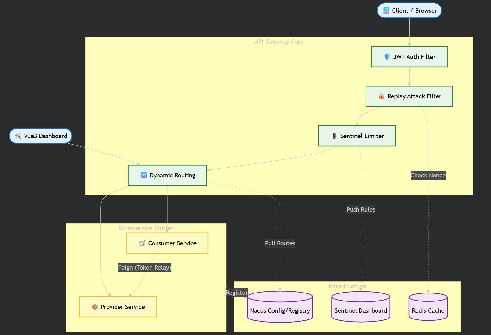
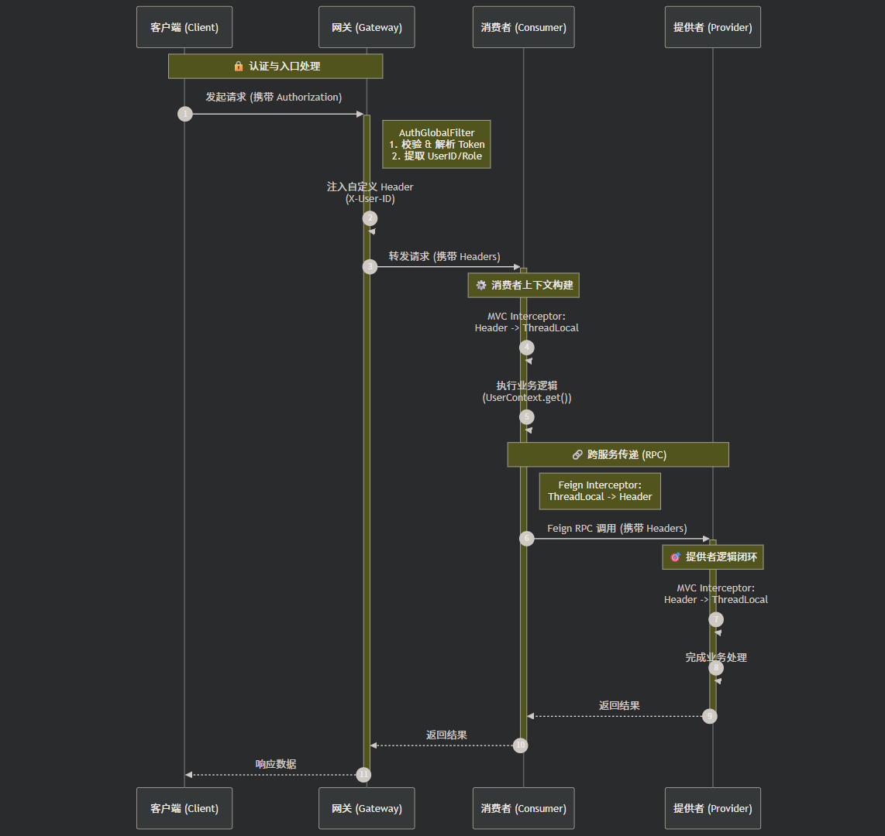
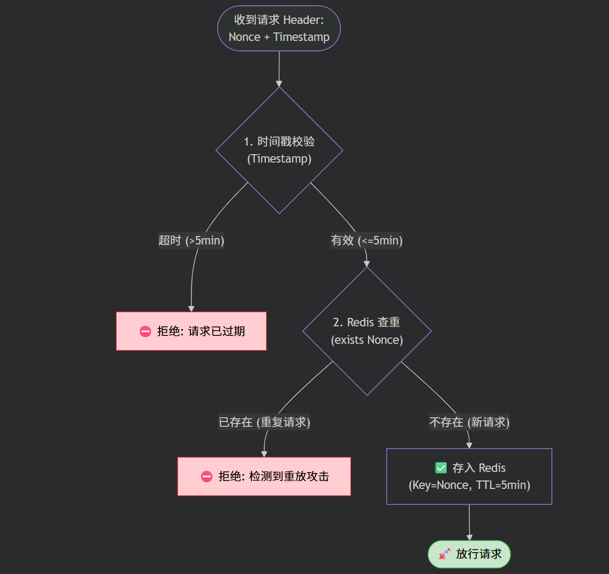
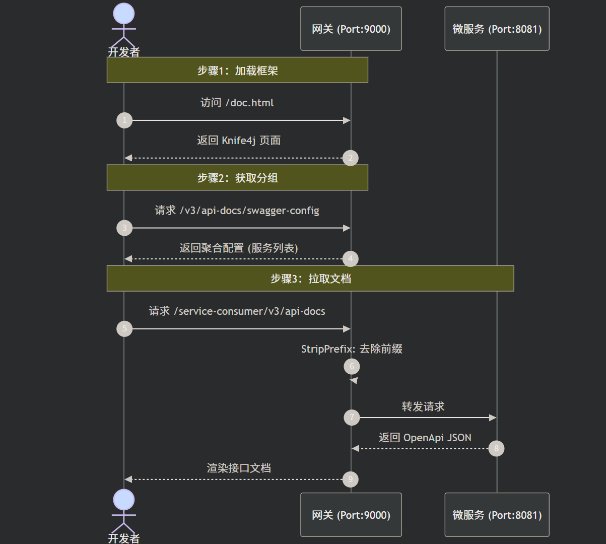
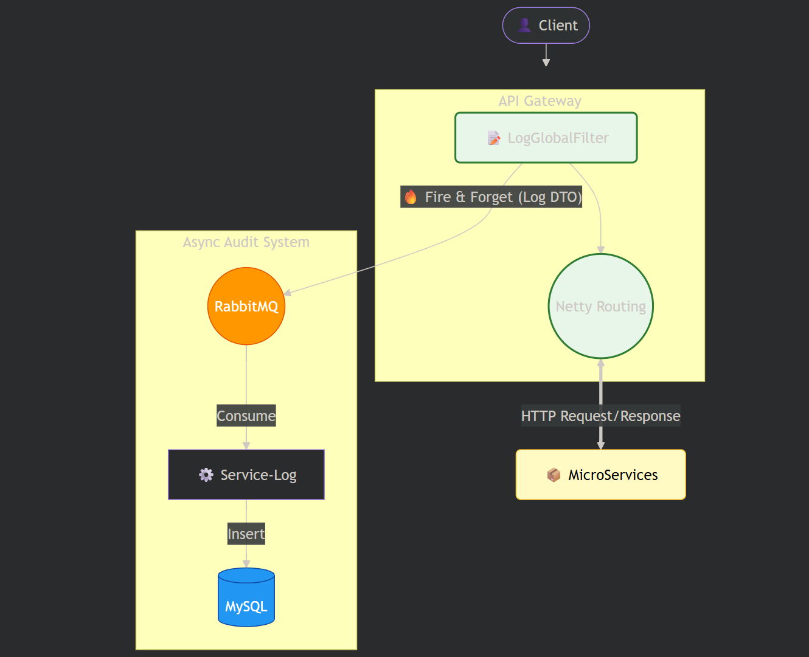
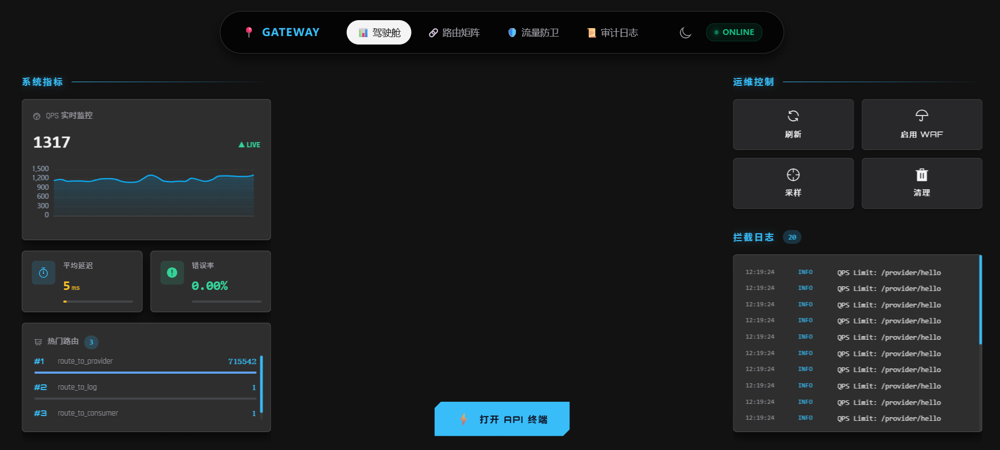
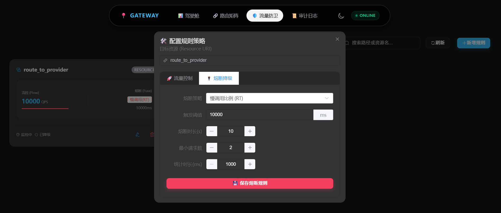

# 🛡️ 微服务流量治理与统一接入网关平台

> 从零构建微服务网关的架构演进与技术沉淀

---

## 📖 项目概述

在微服务架构体系中，网关作为统一流量入口承担着**鉴权认证**、**路由分发**、**流量治理**和**可观测性**等核心职责。本项目基于 Spring Cloud Gateway 响应式架构，实现了从传统阻塞模型到全链路异步化的技术升级。

### 核心成果

- 🎯 **性能突破**：单机 QPS 从 200 优化至 1300+，实现 6.5 倍提升
- 🛡️ **安全加固**：JWT 鉴权 + Redis 防重放双重保障
- 📊 **可视化管理**：自研流量驾驶舱，告别繁琐配置
- 🔍 **全链路追踪**：SkyWalking + 异步日志审计

---

## 🏗️ 架构设计

### 整体架构

网关基于 Spring Cloud Gateway 响应式框架构建，作为核心入口统一调度下游微服务。

**设计思路**：
- **过滤器链模式**：鉴权 → 防重放 → 限流 → 路由，责任链清晰
- **异步非阻塞**：全链路基于 Reactor 响应式编程，避免线程阻塞
- **基础设施解耦**：通过 Nacos、Sentinel、Redis 实现配置与治理的集中管理

---

## 🔍 关键技术实现

### 全链路 Token 透传

**问题背景**：在微服务调用链中，用户身份信息需要在多个服务间无感知传递。

**解决方案**：采用 `ThreadLocal` 结合 `Feign RequestInterceptor` 的闭环方案。

**实现要点**：
1. 网关层解析 JWT，提取 UserID/Role 并注入自定义 Header（X-User-ID）
2. 下游服务通过 MVC Interceptor 将 Header 写入 ThreadLocal
3. Feign 调用时通过 RequestInterceptor 自动携带 Header
4. 调用完成后清理 ThreadLocal，避免内存泄漏

### 防重放攻击机制

**安全威胁**：恶意用户可能截获合法请求并重复发送，造成资源浪费或数据异常。

**防御策略**：Nonce + Timestamp 双重验证机制。

**核心逻辑**：
1. **时间戳校验**：拦截超过 5 分钟的过期请求
2. **Redis 查重**：验证 Nonce（唯一标识）是否已存在
3. **TTL 自动过期**：Nonce 存储设置 5 分钟 TTL，避免 Redis 内存膨胀

### 接口文档聚合

**痛点**：多个微服务的 API 文档分散，开发者需要切换多个地址查阅。

**解决方案**：网关统一拦截 Swagger 资源请求，动态路由重写后聚合展示。

**实现机制**：
1. 拦截 `/doc.html` 请求，返回 Knife4j 前端页面
2. 拦截 `/v3/api-docs/swagger-config`，返回聚合的服务列表
3. 根据路由规则动态代理下游微服务的 `/v3/api-docs` 端点
4. 路径重写后统一展示在网关入口

### 异步日志架构

**性能考量**：同步记录日志会阻塞主业务链路，影响网关吞吐量。

**架构设计**：基于消息队列的 Fire & Forget 模式。

**关键设计**：
- 网关全局过滤器采集请求/响应信息
- 通过 RabbitMQ 异步投递，解耦主链路
- 日志服务独立消费，持久化到 MySQL
- 支持后续扩展为 ELK 日志分析平台

---

## ⚡ 性能优化实践

### 优化背景

初期压测结果显示网关性能远未达标，QPS 在 200~500 波动，且运行 3 分钟后出现断崖式下跌。

### 瓶颈分析

经过 profiling 和日志分析，定位到三大核心问题：

| 问题类型 | 具体表现 | 影响 |
|---------|---------|------|
| **同步阻塞 I/O** | 使用 `StringRedisTemplate` 阻塞 Netty 线程 | 线程池耗尽，请求排队 |
| **资源积压** | SkyWalking 采样率过高导致 OOM | 频繁 Full GC，性能暴跌 |
| **线程切换** | 频繁自定义线程池切换 | Context 丢失，响应延迟 |

### 优化方案

**全链路异步化改造**：
1. 切换 `ReactiveRedisTemplate` + Pipeline 批量操作
2. 移除多余对象创建，实现零拷贝
3. 优化 SkyWalking 采样率与 Netty 线程模型
4. 引入反压保护机制

### 优化效果

| 指标 | 优化前 | 优化后 | 提升 |
|------|--------|--------|------|
| **峰值 QPS** | 200~500 | **1300+** | 6.5x |
| **稳定性** | 3分钟后暴跌 | 长时平滑 | ✅ |
| **延迟** | 高延迟毛刺 | 无明显毛刺 | ✅ |
| **GC** | 频繁 Full GC | 无 Full GC | ✅ |

### 性能损耗分析

下游 Provider 直测 QPS 可达 **6500+**，网关转发 QPS 为 **1300+**，损耗拆解如下：

1. **网络 I/O 翻倍**（50% 损耗）：网关需完成请求接收和响应转发，序列化/反序列化开销翻倍 → 理论上限 3250 QPS
2. **治理组件税收**（30% 损耗）：SkyWalking 字节码增强、Sentinel 滑动窗口统计 → 理论上限 2275 QPS
3. **业务逻辑开销**（10% 损耗）：Redis 异步埋点、JWT 验签计算 → 理论上限 1820 QPS
4. **单机资源争抢**（20%~30% 损耗）：JMeter 与网关抢占 CPU 资源 → 实测 1300+ QPS

> 💡 **结论**：在 Windows 单机混部且开启全套治理逻辑的前提下，1300 QPS 代表了该硬件环境下非阻塞 IO 的性能极限。若部署至 Linux 独立服务器，预计 QPS 可提升至 10k+。

---

## 💻 流量驾驶舱

### 设计理念

将繁琐的配置操作转化为直观的图形化界面，降低运维门槛，提升开发效率。

### 实时监控大屏

直观展示网络拓扑、QPS、错误率及响应耗时等核心指标。

### 可视化配置对比

**原生 Nacos 控制台**配置繁琐，需要手动编写 YAML/JSON：

**自研控制台**实现图形化操作，配置便捷高效：

---

## 🌟 核心特性

### 🚦 流量治理与动态配置

- **动态路由热更新**：基于 Nacos Config 监听机制，配置修改实时生效，无需重启网关
- **精细化限流熔断**：集成 Sentinel 实现路径级限流保护，自定义标准化 JSON 异常回执

### 🛡️ 安全防御体系

- **防重放攻击**：Redis 存储 Nonce + 时间戳校验，双重验证拦截恶意重复请求
- **全链路身份透传**：网关解析-拦截器注入-Feign透传闭环，UserID 无感知传递
- **全局跨域支持**：统一处理 WebFlux 响应式环境下的 CORS 跨域问题

### 📝 观测与审计

- **异步日志系统**：网关全局过滤器采集流量日志，消息队列解耦，异步存库不影响主链路
- **API 文档聚合**：Knife4j 自动发现下游 Doc 资源，网关入口统一查阅全量接口文档

---

## 🛠️ 技术栈

| 分类 | 技术选型 |
|------|----------|
| **核心框架** | Spring Boot 3.2.5 + Spring Cloud Gateway |
| **微服务生态** | Spring Cloud Alibaba (Nacos 2.x, Sentinel) |
| **响应式编程** | Project Reactor |
| **缓存/存储** | Redis 5.x, MySQL 8.0 |
| **消息队列** | RabbitMQ |
| **链路追踪** | SkyWalking |
| **前端技术** | Vue 3 + Vite + Element Plus + ECharts |

---

## 📝 总结与展望

### 技术收获

1. **响应式编程思维**：从同步阻塞到异步非阻塞的范式转变
2. **性能调优方法**：Profiling 工具使用、瓶颈定位与优化策略
3. **架构设计能力**：网关作为基础设施的核心职责与边界划分

### 未来规划

- [ ] 支持多租户隔离与灰度发布
- [ ] 集成 AI 智能限流策略
- [ ] 完善可观测性（Metrics + Tracing + Logging 三位一体）
- [ ] 性能优化目标：Linux 环境 10k+ QPS

---

> 📖 本项目为个人技术实践沉淀，代码与文档持续更新中。欢迎交流探讨！
